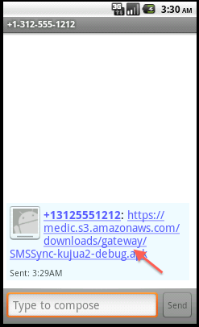
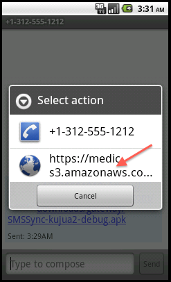
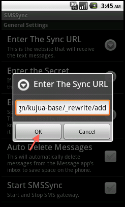
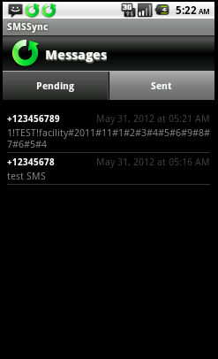
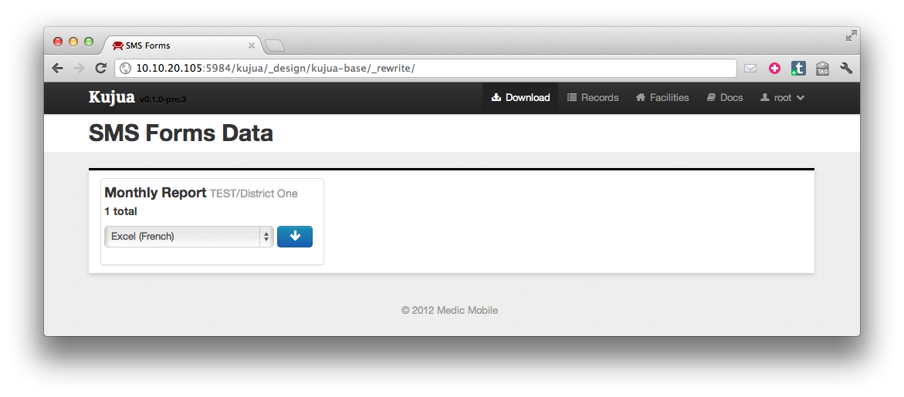

# Install

## Intro

This guide should help you install two main parts of the Medic toolset: Kujua
and SMSSync.  SMSSync is an Android application that receives SMS data and
sends it to a web service via HTTP.  Kujua provides the web service as well as
a web interface to manage your data.  This setup typically used to in
combination with unstructured or structured SMS messages to collect data.

## Install CouchDB

Kujua requires **CouchDB version 1.2 or higher**.  We are currently using the
Couchbase Single Server binaries.  Couchbase provides CouchDB packages that are
easy to install on Windows, Linux or Mac OSX.

### Step 1: Download 

* Click the **Download** button on [Couchbase Single Server 2.0 Preview](http://www.couchbase.org/get/couchbase-single/2.0)
* Choose the right file for your operating system, if you are using Windows for example, download the .exe file.
* Launch or extract the package file and follow the instructions for your operating system to install Couchbase Single Server.

*Note* this guide refers to *CouchDB* and *Couchbase Single Server* synonymously.

### Step 2: Create Admin User

The first thing you should do with any CouchDB database is setup an admin
account if it does not have one.  You will need to think of a secure password,
it should contain numbers, lower and uppercase letters and special characters. 

* Navigate your browser to Futon, the CouchDB admin tool, by default it can be found at <http://localhost:5984/_utils/>.
* Click the **Fix this** link in the bottom right to show the admin create screen.
* Enter the username **root** and a secure password.
* Click **Create**
* Save the password somewhere so you remember it.


### Step 3: Require Valid User

Additionally we recommend you restrict all access to your database to authenticated users.  Change the `require_valid_user` default configuration.

* Click **Configuration** in the right column in Futon.
* Click the `false` value in the `couch_httpd_auth` section.  
* Replace the `false` text with `true` and press the enter key.


## Install Kujua

Since Kujua is just a CouchApp the easiest way to install it by replicating
from another instance of CouchDB.

### Step 1: Replicate 

* Navigate your browser to Futon.
* Click the **Replicator** item in the right column under Tools.


On the Replicator screen complete the following fields and their corresponding values:

* Replicate Changes from: **Remote Database** ```https://medic.iriscouch.com/kujua-base```
* to: **Local Database** ```kujua```\*
* Click the **Replicate** button
* After you click replicate verify your screen updates with the replication session data:


* Verify you can navigate to the home screen:
<http://127.0.0.1:5984/kujua/_design/kujua-base/_rewrite/>, you should see the
home screen:


## Verify Network Configuration

The next section explains how to find your local network IP address, more
specifically the network address that CouchDB is listening on.  In this guide
we assume there are two devices on **the same IP network**, this is typically a
laptop and phone on a secured LAN via wireless or USB tethering.  

### Step 1: Verify your IP address

On Windows the easiest way to find your IP address is:

* Start a command window by navigating to **Start > Run** then type ```cmd``` and choose **OK**.


* Type ```ipconfig``` and hit return.  


This should provide you with an IP address on the local network.  We assume you
know enough about your system to find this piece of common information if not
on Windows.

### Step 2: Verify CouchDB is listening

Now to verify CouchDB is listening on a network address you can use your web
browser.  

* Type the IP address into the browser address bar and **append the following port number** prefaced with a colon ```:5984```. In this example the complete address is ```http://10.10.20.105:5984```.
* Verify you see a status message from CouchDB.


### Step 3: Verify the Export tool

* Now append the following path to it:
  ```/kujua/_design/kujua-base/_rewrite/```.<br /> In this example we use 
  ```http://10.10.20.105:5984/kujua/_design/kujua-base/_rewrite/```.
* Verify that the Export app responds with a screen similiar to the one below.
* Now **copy your local network URL somewhere**, possibly in the clipboard or notepad.  You will need it for the next steps.


## Install SMSSync

At the time of this writing we are using a modified version of [SMSSync by
Ushahidi](http://smssync.ushahidi.com/) as the gateway; your device needs to run Android version 2.2 or higher.

### Step 1: Allow Installation of non-Market Applications 

* On your device navigate and enable **Settings > Applications > Unknown Sources**


### Step 2: Download SMSSync to Device


* Copy this link destination: [SMSSync 1.1.9-kujua.2](gateway/SMSSync-kujua2-debug.apk)\*
* Send the gateway download URL to the device either through SMS, email or other 
means, then open it in your Android browser.  You can type it manually into the
address bar too.
* Choose **Accept** when Android prompts you to download.  The file is approximately 200KB and should download to your SD Card pretty quickly.





\* Checksums: 
[md5](gateway/SMSSync-kujua2-debug.apk.md5),
[sha](gateway/SMSSync-kujua2-debug.apk.sha)

\* We also maintain a copy on the web: [SMSSync 1.1.9-kujua.2](https://medic.s3.amazonaws.com/downloads/gateway/SMSSync-kujua2-debug.apk)

### Step 3: Install SMSSync on Device

* Open your browser and go to settings
* Choose the **More** option
* Choose **Downloads** from the menu
* Choose **SMSSync-kujua** package from the download history


* Choose **Install** from the SMSSync menu
* Wait a few seconds for the application to install
* Choose **Open** from the SMSSync menu


## Configure SMSSync

### Step 1: Enter the Sync URL

Now configure SMSSync with the URL to our Export application:

* Launch SMSSync 
* Edit Settings
* Choose **Enter the Sync URL** option
* Enter the local network URL you discovered in the Verify Network steps above and **append one more part**: `add`.  Complete example: `http://10.10.20.105:5984/kujua/_design/kujua-base/_rewrite/add`.
* Choose **OK**




### Step 2: Configure a few more options

* **Start the SMS gateway**.  You will see a status icon in the notifications bar that tells you it is running.
* Scroll down a bit further and set **Get Reply From Server** so the person submitting the report gets a messaging confirming it was received.
* Finally and set **Enable Task Checking** so the gateway processes outgoing messages.


#### Language/Locale parameter

The gateway processes responses from Kujua so it is important that these
responses are in the correct language and locale.  If you want to specify your
locale, you can append the `locale` query parameter to the sync URL above.  The
default locale is english or `en` and we also support `fr` at the moment.  

For example, to get responses from Kujua in french use
`http://10.10.20.105:5984/kujua/_design/kujua-base/_rewrite/add?locale=fr`.

## Test the Pipes

Now the setup of the Gateway and Export tools should all be complete.  Let's
see the fruits of our labor in action; this should also help us understand how
it all fits together.

### Step 1: Sync Tests

* With SMSSync running and on the main screen where you can see **Sent** and
  **Pending** tabs, send a SMS message to the Android device from another phone.
* Observe the Android phone receive the message in the notification bar.
* Observe the **SMSSync Message Sent** notice.
* Choose the **Sent** tab and notice your message in the Sent box.
* Send another message but using a special **Report format**,<br />
  for example, ```1!PSMS!facility#2011#11#1#2#3#4#5#6#9#8#7#6#5#4```.
* Observe your report data in the Sent box again.




*Note*, if messages are in the Sent box that means they were successfully synced or 
saved to CouchDB.

### Step 2: View Response

* You should also receive a response from the gateway, like **Zikomo!**


*Note*, our version of SMSSync won't send SMS responses to itself because this can
cause an endless loop of error responses to and from the gateway.

### Step 3: View Report Data

Now lets see if we can get our data out of the database and in a useful format; the Export tool does this.

* Browse to the export tool
* Choose the download format your prefer
* Choose the **PSMS: Download** button and a file should download to your computer.



* Now open the file in your favorite spreadsheet program and verify the
  formatting, field names and data look accurate.


