# 2.15.0 Release Notes

- [What's New](#whats-new)
    - [View 'clinic' Places in Places Filter](#view-clinic-places-in-places-filter)
    - [Just-in-Time Messages](#just-in-time-messages)
    - [Reports Tab Shows Patient Name](#reports-tab-shows-patient-name)
    - [Export to CSV ](#export-to-csv)
    - [Fine-Grained Time on Reports List](#fine-grained-time-on-reports-list)
    - [Updated Styling for Tasks Due Today](#updated-styling-for-tasks-due-today)
    - [Updated Icon for CHW Area](#updated-icon-for-chw-area)
    - [New Date Filter](#new-date-filter)
    - [Improved Nurse-Enabled Workflows on SMS](#improved-nurse-enabled-workflows-on-sms)
    - [Updated Enketo UI](#updated-enketo-ui)
    - [Allow Users to Compare Translations to Translation Keys](#allow-users-to-compare-translations-to-translation-keys)
    - [Death Reporting](#death-reporting)
    - [Report Linkages](#report-linkages)
    - [Permissions to Show/Hide Call and Message Buttons ](#permissions-to-showhide-call-and-message-buttons)
- [Bug Fixes](#bug-fixes)
    - [Contact Pagination Fixed for Restricted Users](#contact-pagination-fixed-for-restricted-users)

## What's New

### View 'clinic' Places in Places Filter

_You might have noticed that for SMS projects, CHW areas went missing from the places filter in the Reports tab. Good news! They are back._

When we started having CHWs log into the Medic app and register families, the places filter on the reports page became crowded with thousands of families, creating a performance issue. To get around that issue, we removed `'clinic'` level places from this filter drop-down so that users would only see health centers and CHW areas, no families. This meant that no one could filter by family, but that wasn't a needed feature. 

#### Filter bar, place filter highlighted
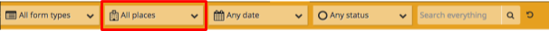

However, as we started using version 2 with our SMS projects, we needed the ability to filter by CHW area. In those projects, CHW areas are the `'clinic'` level places. In order to avoid further performance issues for projects that register families, we made this a configurable option.

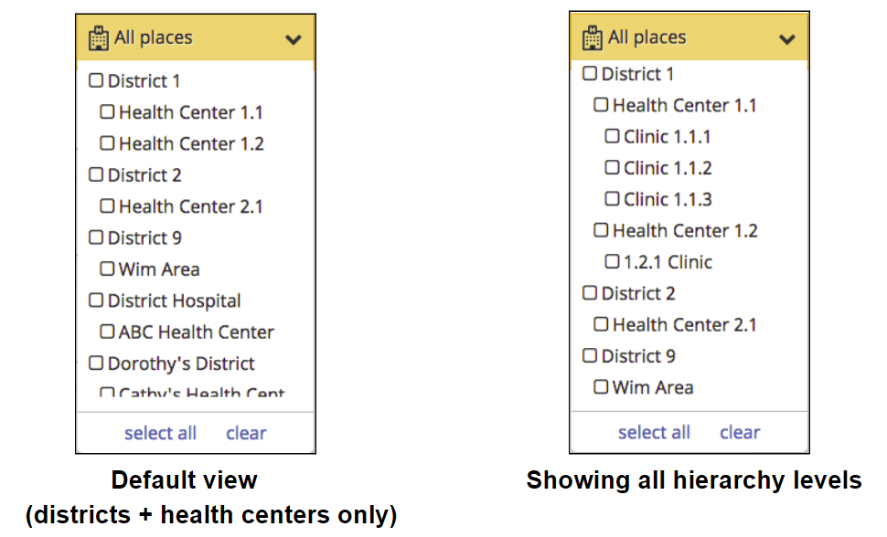
			
The default is to show only the `district_hospital` and `health_center` levels in the places filter. If you only want to see those two levels, there is no need to change your config. However, if you want to see the `clinic` places as well, you will need to add the following anywhere in your `app_settings.json` file:


```
    "place_hierarchy_types": ["district_hospital", "health_center", "clinic"],
```


**DO NOT** display `clinic` places if your project is registering families as this will cause performance issues with admin or program manager (full access) users rendering the reports page.

[[#3902](https://github.com/medic/medic-webapp/issues/3902)]


### Just-in-Time Messages

_Just-in-time messages are available just in time for you to get those messages to that CHW who changed her phone number last week. And if she got any messages in the wrong language, we've got you covered._

Previously, the phone number and outgoing message language were set at the time that a schedule was created. If a CHW changed her phone number, only new registrations would go to the new phone number. Any schedules that were ongoing would still send messages to her old phone number. 

With this new feature, any updates to phone numbers are reflected in real time for any scheduled messages that are not yet pending or sent. In addition, if there are messages in your schedule going to the nurse or a CHW supervisor and they have to change their phone number, any messages in existing schedules that are going to be sent to them in the future will go to the new numbers.

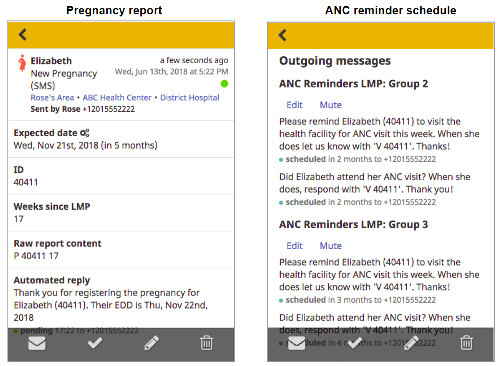

After updating Elizabeth's phone number, you'll see the following. Note that the auto-reply will have been sent to her old phone number because it was sent immediately after registration. If you look at the outgoing messages, you'll see that all have been updated to use Elizabeth's new number.

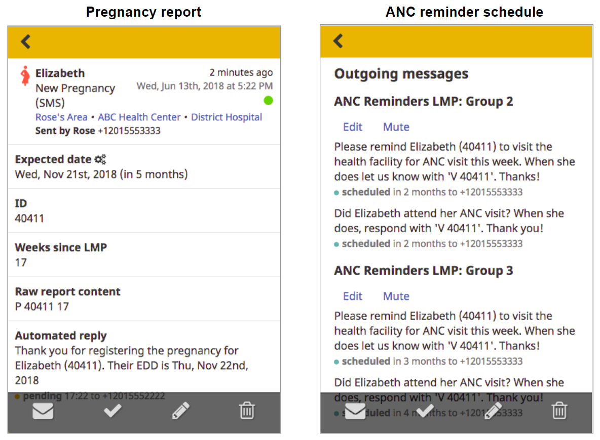

This improvement also affects outgoing message language. If the outgoing message language is changed, all future messages, including those in ongoing schedules, will be sent in the new language. So if a CHW registers a pregnancy and the outgoing messages are generated in English initially, if the project changes the outgoing language to Swahili, any remaining messages will be sent out in Swahili.

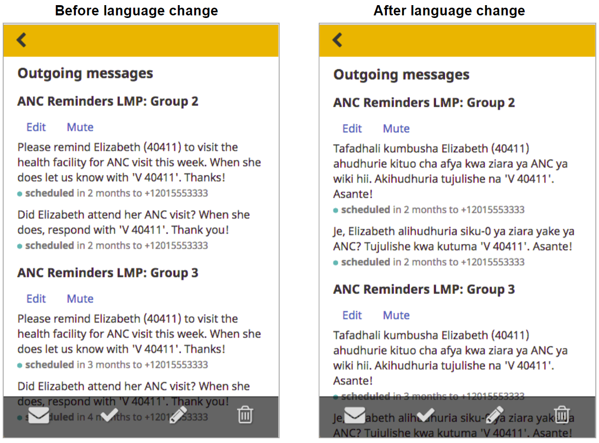

These changes will occur as soon as you reload the report(s) affected by the update. You should see the new phone number appear as the recipient of any future scheduled messages. The future scheduled messages should also be in the new language for outgoing messages, if you've updated that.

In order for this feature to work for both phone number and translation updates, you must make sure your config:

1.  **Uses only translation keys for ALL outgoing messages**, including scheduled messages, auto-replies, and notifications. You must remove ALL message arrays and replace with translation keys.
1.  **Uses the correct alias for each message recipient for all scheduled messages**. We are no longer recommending that you use `reporting_unit` as the message recipient for message schedules. Instead, use `clinic` (to send to the patient's CHW), `health_center` (to send to the nurse / primary contact of the health center), or `district` (to send to the primary contact at the district level). This will help ensure that phone numbers are updated in real time. Using `reporting_unit `for auto-replies and notifications is completely fine as these go out immediately after a report is received. The exception to this might be in cases where both nurses and CHWs are confirming visits and/or deliveries via SMS and you want to notify the CHW. 

[More on this below](#improved-nurse-enabled-workflows-on-sms).

Your config will look something like this (**See the Standard <code>[app_settings.json](https://github.com/medic/medic-projects/blob/master/standard/app_settings.json)</code> file for a full example)</strong>:


```
{
      "name": "ANC Reminders LMP",
      "translation_key": "schedule.anc_lmp",
      "summary": "",
      "description": "",
      "start_from": "lmp_date",
      "messages": [
        {
          "translation_key": "messages.schedule.anc.reminder",
          "group": 1,
          "offset": "12 weeks",
          "send_day": "monday",
          "send_time": "09:00",
          "recipient": "clinic"
        },
        {
          "translation_key": "messages.schedule.anc.followup",
          "group": 1,
          "offset": "13 weeks",
          "send_day": "monday",
          "send_time": "10:00",
          "recipient": "clinic"
        }, … 
```


[[#3627](https://github.com/medic/medic-webapp/issues/3627)]


### Reports Tab Shows Patient Name

_Have you been wondering why your CHW has been pregnant 58 times? Now you'll be able to see the patient name associated with the pregnancy from the main list of the Reports tab._

Previously, the Reports tab displayed the name of the person who submitted a particular report. We received feedback that it was more useful to display the name of the patient, so we have updated the reports list and the report detail page to show the patient's name at the top. 

In the reports list, we show the patient's name first so that a CHW or manager can easily see which patient the report is about. Next is the type of form, which is the same as in previous versions. Below the name of the form, we have included the patient's hierarchy so that it's easy to see at a glance which CHW area that patient belongs to.

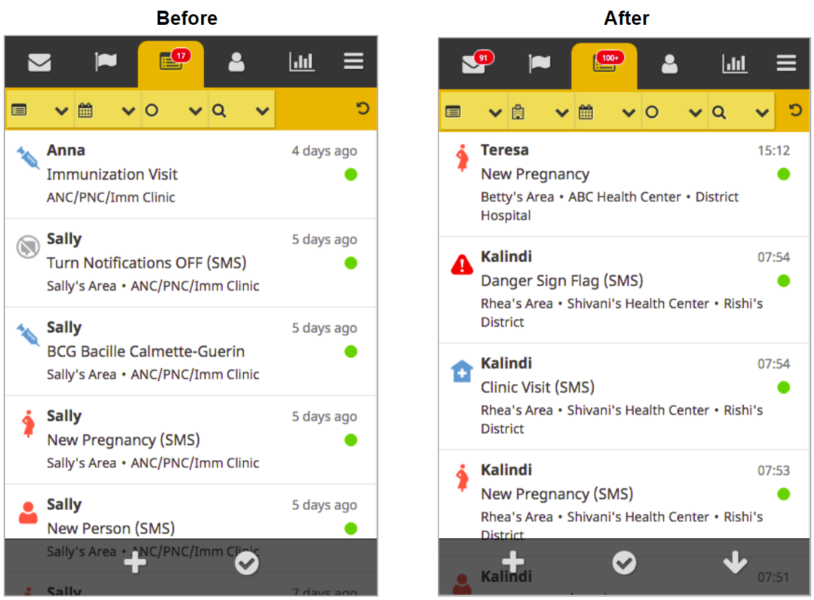

If you then click on a report, you get to the report detail view, which again shows the patient's name at the top. Below is the name of the form, which is the same as in previous versions. After the form name is the patient's hierarchy, so it's clear which CHW area the patient belongs to. Finally, we list the person who sent the report and that person's phone number. In this case it's the CHW, Brandon Bone, but it could also be a nurse or another person in the health system. If the phone number does not match anyone in the Medic system, it will simply show the phone number of the person who submitted the report with no name listed.

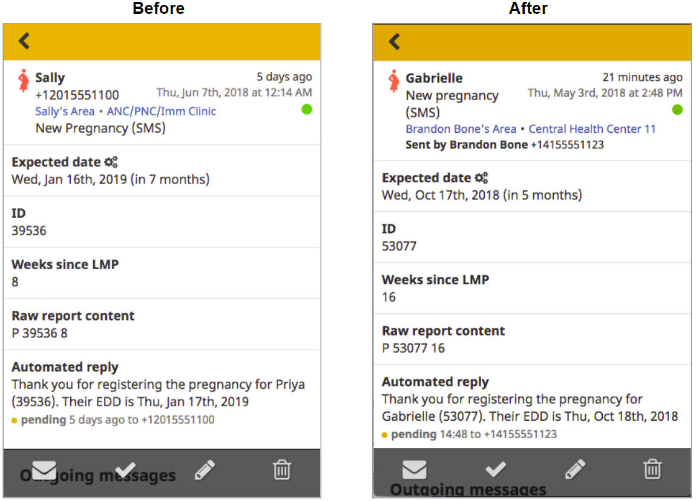

[[#4053](https://github.com/medic/medic-webapp/issues/4053)]


### Export to CSV 

_Ever use our export to XML feature? Nope? We didn't either. Now you can export to CSV for all of your data analysis needs. Get your pivot table on!_

Starting in 2.15.0, you can now export data directly from the Medic webapp in CSV format. You can choose to export all records or you may use the filters on the reports page to export a subset of reports. Whatever is appearing when you click Export is what will download, so if some filters have been applied before clicking Export, then your CSV will only include the reports that fit your filter criteria. Every export will include all forms and all fields, so if you download more than one type of form, you may find that you have a lot of columns, but this is just to ensure that we have a column for each field in each form since forms have different field names. Only admins can export because exporting returns all reports so it's only available to users who are allowed to access all data. \


Note that after you click Export, it may take 10 seconds or so before the Export starts downloading, so be patient! [[#3594](https://github.com/medic/medic-webapp/issues/3594)]


### Fine-Grained Time on Reports List

_At 15:02 on June 6th, we made it possible for you to see the exact time your reports came in._

Starting in 2.15.0, reports received today show the exact time. This makes it easier to see how many reports have come in today at a glance. This way you can see if the gateway is working properly. Once you get to the next day, reports will use relative times and dates as they had prior to this change.

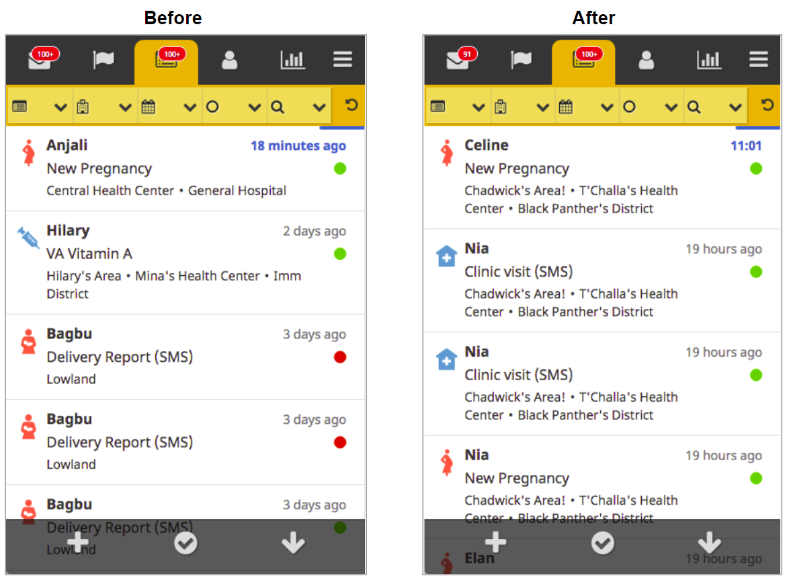

[[#3613](https://github.com/medic/medic-webapp/issues/3613)]


### Updated Styling for Tasks Due Today

_Now you have no excuse not to complete your tasks, especially if you hate the color blue._

We made a small update to the Tasks list so that tasks due today are easier to find in the list. Starting in 2.15.0, tasks due today now have bold, blue due dates. This helps to distinguish them from tasks due in the past, which are bold and red, and tasks due in the future, which are still gray and regular weight.

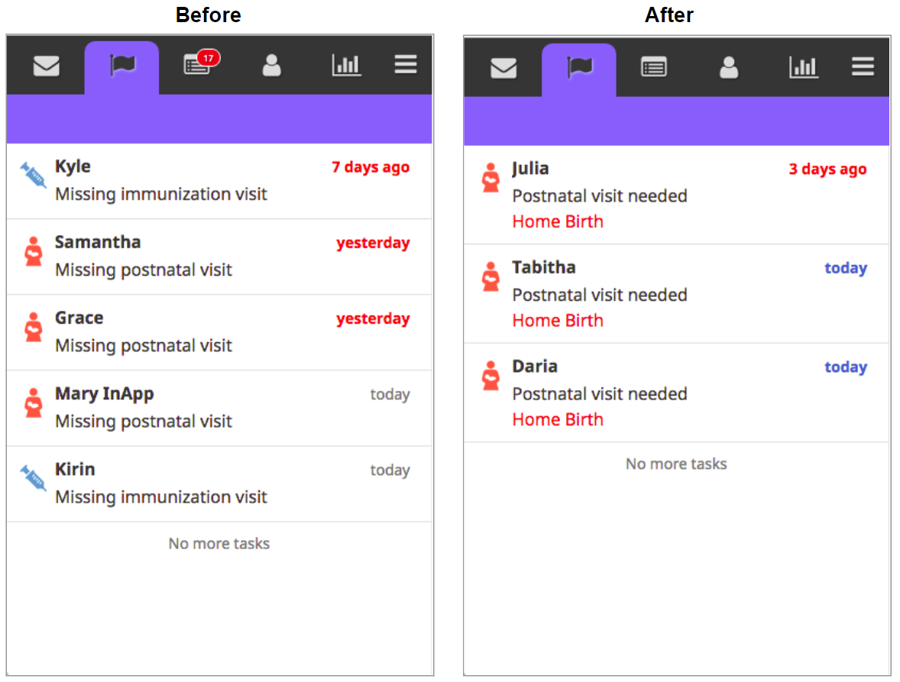

[[#4000](https://github.com/medic/medic-webapp/issues/4000)]


### Updated Icon for CHW Area

_Wondering what that petri dish icon was for? We're experimenting with a new icon for CHW areas._

Please swap out for your projects! The new icon is available in medic-projects and we'll be shipping it as the default icon starting in 2.16.0.

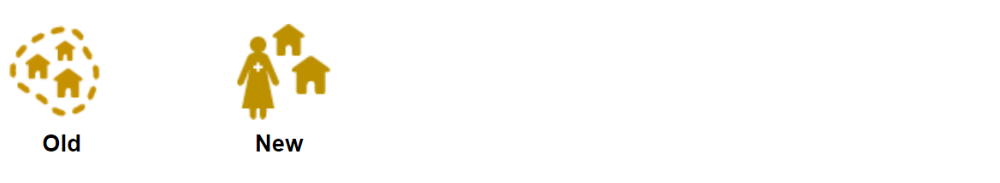

### New Date Filter

_Now you can format dates on condition cards in the way that most of the world talks about them: date then month. Up next: how to get the US on the metric system?_

We added a new date filter to provide more flexibility in how dates are displayed in condition cards. Now you can display dates like birthdates or EDDs in the format shown below (DD Month). This makes the date easier to read at a glance. If you want your date to show up in this format, use the `dayMonth` filter for date fields in your `contact-summary.js` file.

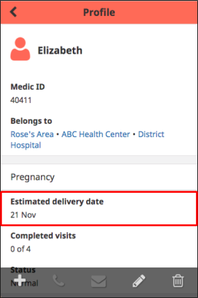

[[#3721](https://github.com/medic/medic-webapp/issues/3721)]


### Improved Nurse-Enabled Workflows on SMS 

_Nurses are busy and can't always sit down in front of the webapp. We're now able to notify a CHW of when a nurse submits a patient report via SMS._

This feature is an enhancement for SMS workflows where nurses are confirming visits or deliveries using Textforms or Collect. We've made it possible for the CHW to receive an SMS notification when a nurse confirms a visit or delivery via SMS. The diagram below describes how the messages would flow.

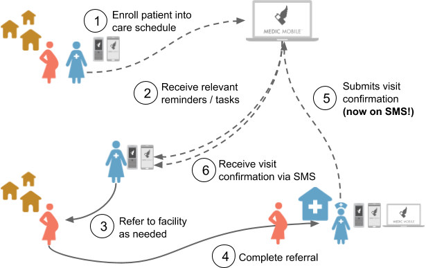

To help make configuration easier, we have some new aliases available ([mentioned earlier in this doc](#just-in-time-messages)). The new aliases are `clinic`, `health_center`, and `district` and they are calculated off of the patient. The `clinic` is the CHW area, so the message goes to the CHW; `health_center` is the facility level, so the message goes to the primary contact of the health facility; and `district` is the district hospital level, so the message goes to the primary contact of the district hospital.

If your project has both the CHW and the nurse confirming visits, you'll want to send only an auto-reply when the CHW reports a visit but you'll want to send both an auto-reply and a notification when the nurse reports a visit so that the nurse knows the visit report was received and the CHW knows the patient went to the facility. You can use a `bool_expr` on the CHW notification so that it only goes out when it's a nurse sending in the visit confirmation.

[[#3412](https://github.com/medic/medic-webapp/issues/3412)]


### Updated Enketo UI 

_UI fairy dust alert! We made forms prettier._

Starting in 2.15.0, Enketo forms have a larger font for the questions, more space between questions, and larger clickable areas for radio buttons and checkboxes. On Desktop, all forms have a header that persists for all pages of the form so that the user knows which form she is filling in.

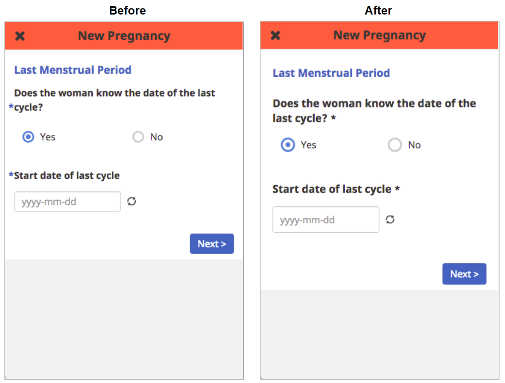


#### Before

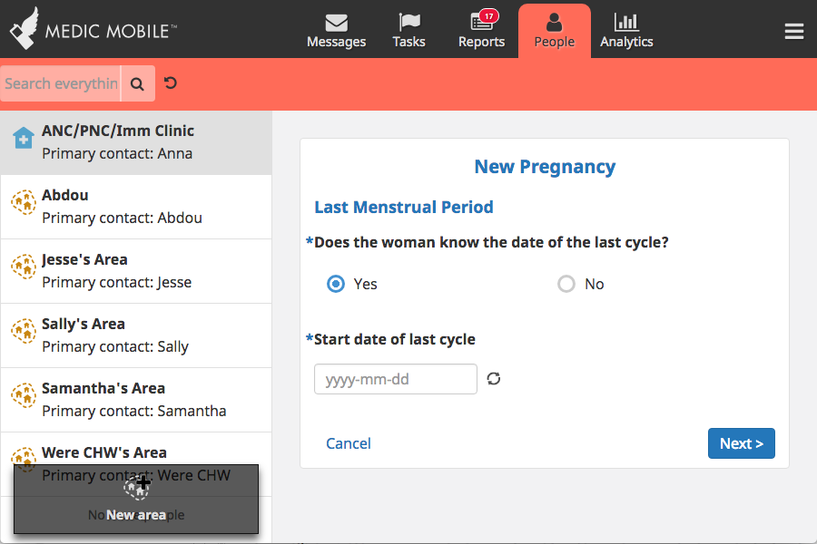


#### After

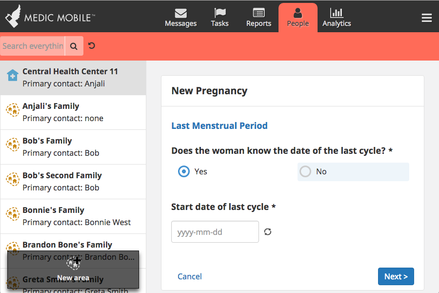

[[#3961](https://github.com/medic/medic-webapp/issues/3961)]


### Allow Users to Compare Translations to Translation Keys 

_We're making it easier to keep track of what you're translating so we're all speaking the same language, even when we're not._

In 2.15.0, we added an option to the left side drop-down so that you can display the translation keys. This makes it easier to know what you are translating and where it will appear in the app. It also allows PMs to more easily update translations for scheduled messages, targets, and tasks titles, among other things.

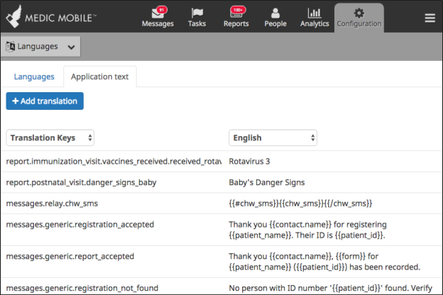

[[#3022](https://github.com/medic/medic-webapp/issues/3022)]


### Death Reporting

_More than a feature, we're now supporting death reporting workflows which allow a user to report a death, another user to confirm that death, and all users to see which family members are deceased on both person and household profiles. Also includes the ever-popular "resurrection" feature which allows us to undo a death._

Our app now supports an expanded workflow for death reporting. The sketch below outlines the basic death reporting workflow that can be done on SMS or in our app, or with a combination of both app and SMS. Some health systems may not require a confirmation of the death by someone other than the CHW, or the person doing the confirmations may not be a user of our tools. In that case, the workflow can be simplified to just step one, where the CHW reports the death.

Step one (death report) can be submitted by the CHW via SMS or the mobile app. Once the death report is submitted, the manager or nurse can get an SMS notification or a task to follow up with the community to confirm the death (until the supervisor app is built, the manager/nurse would need access to patient reports in order to get this task). The manager or nurse would then confirm the death and submit a death confirmation report. Once the death is confirmed, the person is marked as deceased in the app.

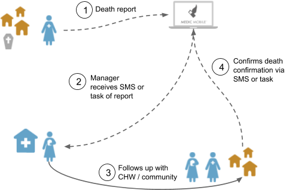

There are a few things that can happen when someone is marked as deceased. First, the app can update a person's profile to make it clear the person is deceased. It can also automatically update the family (or CHW area for SMS projects) profile to separate any deceased people from other people in the family or area. Finally, any deceased people will appear at the bottom of search results. **Tech leads**: make sure you also configure all tasks so that they are cleared when a person is confirmed to be deceased. The app will add a `date_of_death` field to the person's doc once the death is confirmed.

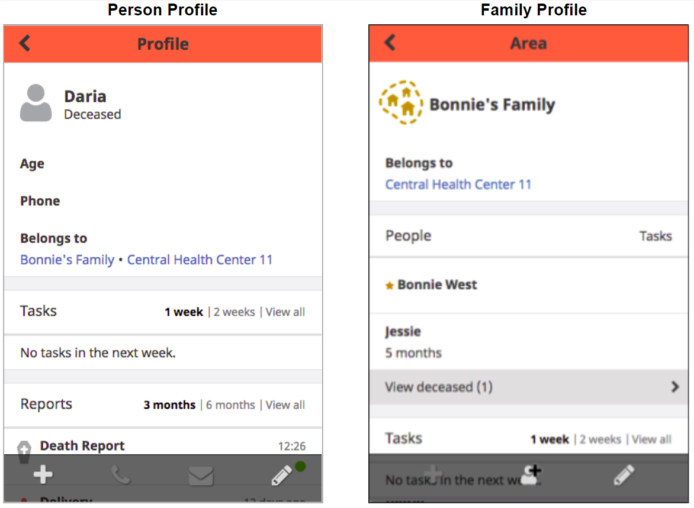

What happens if a death is confirmed but it turns out to have been done in error? We also support a workflow for undoing a death. A CHW can request a correction and if the nurse or manager agrees that a correction is needed, she can undo the death. This reverses all of the profile changes noted above.

To configure a death reporting workflow, you will need:

*   Death report form
*   Death confirmation form
*   Request correction form
*   Undo death form
*   Task or SMS notification for nurse or manager to confirm the death
*   Task or SMS notification for nurse or manager to undo the death
*   New configuration for all person-level tasks so that they clear as soon as the death confirmation form is submitted if that form indicates the person is actually deceased
*   Enable the `death_reporting` Sentinel transition
*   A `death_reporting` property in `app_settings` so that you can indicate which form should confirm deaths and which form should undo deaths

Here's an example of what you would add to `app_settings` to get the profile updates to work:

```
"transitions": {
    "death_reporting": true
},
"death_reporting": {
  "mark_deceased_forms": [
    "death_confirmation"
  ],
  "undo_deceased_forms": [
    "undo_death"
  ]
}
```

The Sentinel transition simply adds a date of death of the person to their profile doc. Currently, it will be the `reported_date` of the death confirmation form. This is not currently customizable, but you can choose to display the date the CHW entered as the date of death on the person's profile. We are planning to improve this in 2.16.0 by allowing you to use a `date_of_death` field in your death confirmation form as the date that is transferred to the person's doc. If you want to record dates of death for people but not have the profiles update, just use the transition and don't add the `death_reporting` property to `app_settings`.

[[#3956](https://github.com/medic/medic-webapp/issues/3956)]


### Report Linkages

_Please accept our apology... We know you loved showing off your SQL skills, but we've made it easier to link certain forms together in PostgreSQL with the addition of a few new fields._

We've added some new fields to reports to help make it easier to write queries in analytics. You'll need to run sentinel transitions for these to work. All of these fields can be added to SMS forms and some can be added to app forms. Here's a list of what's been added:


*   Any report that runs the `registration` transition and invokes the `add_patient` (or deprecated `add_patient_id`) trigger will create a patient doc with a `source_id` field referencing the report and a `created_by` field referencing the ID of the contact who submitted the report.
    *   This makes it possible to know who created each person and links the person to the form used to register them.
*   Any report that clears a schedule either via the `accept_patient_reports` transition or the `clear_schedule` trigger in the `registration` transition will have the ID of the latest matching registration recorded in the `registration_id` field.
    *   If you register a pregnancy and then submit a V form, the V form will have a `registration_id `which is the ID of the most recent pregnancy registration.
    *   If you submit a D form for a pregnancy that was previously registered, the D form will have a `registration_id` which is the ID of the most recent pregnancy registration.
    *   This also applies to any other schedule that is generated by registering a patient (PNC, Immunizations, etc.). Any visit form will have the ID of the most recent registration.
*   Any scheduled message that is cleared before being sent will have a `cleared_by` field with the report that caused the task to be cleared.
    *   If you register a pregnancy and receive the first visit reminder (Please remind Janet to go to the clinic for ANC), then submit a V form, the second reminder (Did Janet attend her visit?) would be cleared. That reminder would have a `cleared_by` field which is the ID of the V form.
    *   If you register a pregnancy and then send in a D form, all remaining reminders are cleared. Each of the reminders would have a `cleared_by` field which is the ID of the V form.
    *   This also applied to any other scheduled messages that are cleared - we will always know which report cleared the message.

[[#3959](https://github.com/medic/medic-webapp/issues/3959)]


### Permissions to Show/Hide Call and Message Buttons 

_Call me, maybe._

We've added two new permissions to our list so that you can determine whether users should see the call and message buttons when they are viewing a person's profile. These buttons will appear by default, but you can remove a user type's access to them, in case you want to prevent CHWs from having the call or message options, for example.

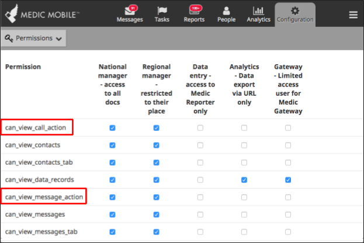

[[#3657](https://github.com/medic/medic-webapp/issues/3657)]

## Bug Fixes

### Contact Pagination Fixed for Restricted Users 

_Call off the search party, your missing families have been found!_

You might have noticed that some contacts were not appearing on the people tab. Turns out we had a pagination bug. Sorry for those who couldn't find their missing families! This is now fixed.

[[#4085](https://github.com/medic/medic-webapp/issues/4085)]