# 2.16.0 Release Notes

- [What's New](#whats-new)
    - [View date last visited for places on the people tab](#view-date-last-visited-for-places-on-the-people-tab)
    - [Sort places by date last visited](#sort-places-by-date-last-visited)
    - [Toggle Universal Health Coverage mode on and off](#toggle-universal-health-coverage-mode-on-and-off)
    - [Expand use of the verify button for manager review of CHW reports](#expand-use-of-the-verify-button-for-manager-review-of-chw-reports)
    - [Allow supervisors to review specific patient reports](#allow-supervisors-to-review-specific-patient-reports)
    - [Add new statuses to the status filter on the reports page](#add-new-statuses-to-the-status-filter-on-the-reports-page)
    - [Use family equity score in tasks and actions about family members](#use-family-equity-score-in-tasks-and-actions-about-family-members)
    - [Ability to add more user roles](#ability-to-add-more-user-roles)
    - [Changed use of colored dot on the reports page](#changed-use-of-colored-dot-on-the-reports-page)
    - [Updated header for reports](#updated-header-for-reports)
    - [Allow death confirmation form to specify the date of death](#allow-death-confirmation-form-to-specify-the-date-of-death)
- [Bug Fixes](#bug-fixes)
    - [Updated google-libphonenumber](#updated-google-libphonenumber)
    - [Fixed a performance issue with loading contacts](#fixed-a-performance-issue-with-loading-contacts)

## What's New

### View date last visited for places on the people tab

_Because knowing where you've been helps you know where you're going next! - Medic proverb_

In order to help CHWs achieve full coverage of every family or household they care for, we've added an optional feature to update the list of families or areas to display the date that family or area was last visited. You can use any patient- or family-level form or forms to update the date last visited. You may run into performance issues if you configure this to look at forms submitted very frequently. For example, we expect five forms submitted only once a month to work better than two forms submitted every day. Make sure you test!

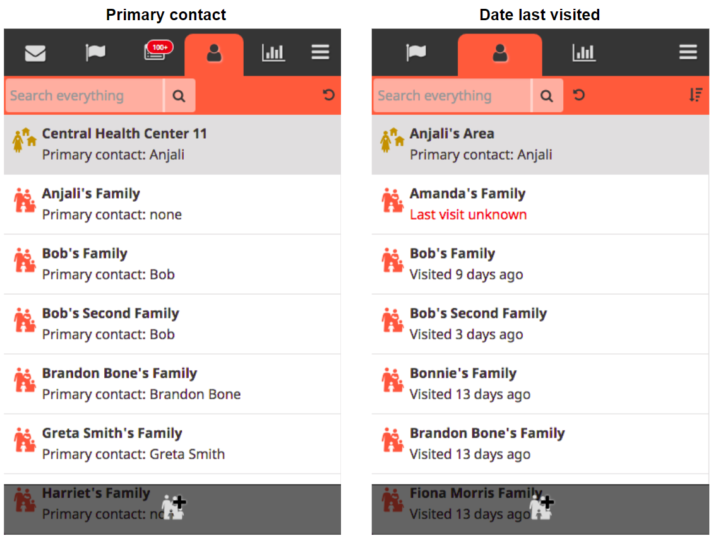

In order to see the date last visited instead of the primary contact, make sure you give your CHWs (or whichever users need to see date last visited) the `can_view_last_visited_date` permission. Once that permission is enabled, you'll be able to display the date the family was last visited in the list. Make sure you have this permission enabled in `app_settings` to avoid overwriting the permission when you upload your config:

```
{
  "name": "can_view_last_visited_date",
  "roles": [
    "chw",
    "district_admin"
  ]
}
```

When you first implement this, you'll see a long list of "Last visit unknown". You'll need to indicate which forms should be included in the calculation for the date last visited. You can use forms at the person or family level, though it is preferable to limit the number of forms included to the minimal number to avoid performance issues.

Indicating that a form should be included in the calculation for the date last visited is as simple as adding a field called `visited_contact_uuid` to your form. This should be a `calculate` field that contains the family/household (`clinic` level place) UUID. Make sure this is a top-level field (not in any group and will be in `doc.fields.visited_contact_uuid` when you submit). To test, upload your form with this field, fill it out and submit, and your people list will update with the correct relative date. Note that you may need to refresh the people tab by either clicking refresh or navigating to another tab and then back.

Example XLSForm (this is a patient-level form):

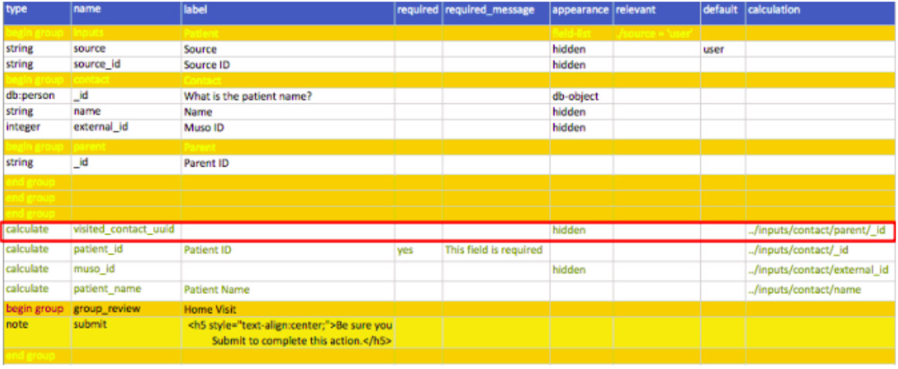

[[#4526](https://github.com/medic/medic-webapp/issues/4526)]

### Sort places by date last visited

_Puts the households who haven't been seen in the longest time at the top, because you know how you hated it in school when the kids whose last names ended in "A" always got to be first in line?_

When you enable the permission to see the date last visited in the people tab list, you will notice that a new icon appears in the top bar. This icon is for sorting the list of people. The default sort is alphabetical, as you have probably noticed. The new icon allows you to sort your families or households by the date last visited. You will need to enable the permission for viewing the date last visited and configure one or more forms to be included in the calculation of the last visit date for each family ([see previous section](#view-date-last-visited-for-places-on-the-people-tab)). Once you've done that, the sort will just work. By default, when you sort by "date last visited," the households you saw _least_ recently will be at the top, gradually increasing to those you saw most recently. Because you know, you should prioritize the households who haven't been seen in the longest amount of time.

Fun fact: We drew this feature for the first time while chatting about visit practices in a workshop with LG CHPs in Uganda. See the drawings on the lower right that shows a family list being reordered by date, with those visited least recently at the top.

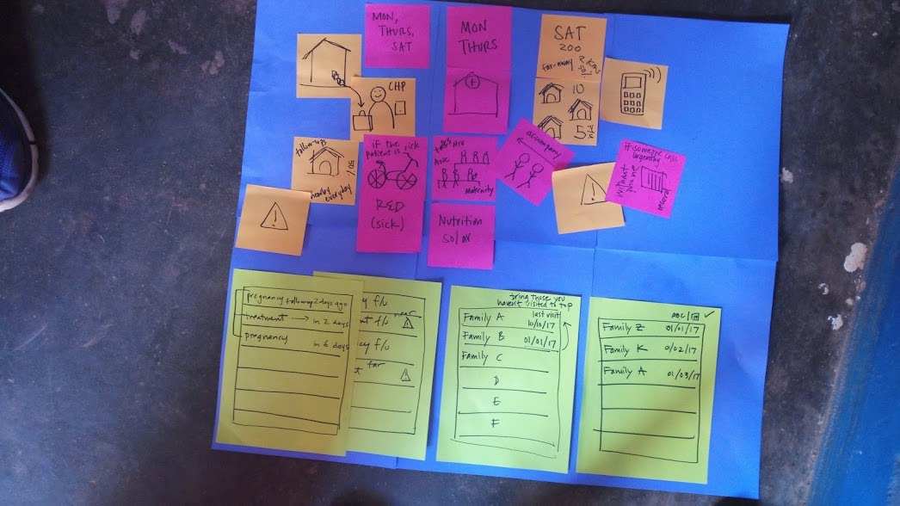

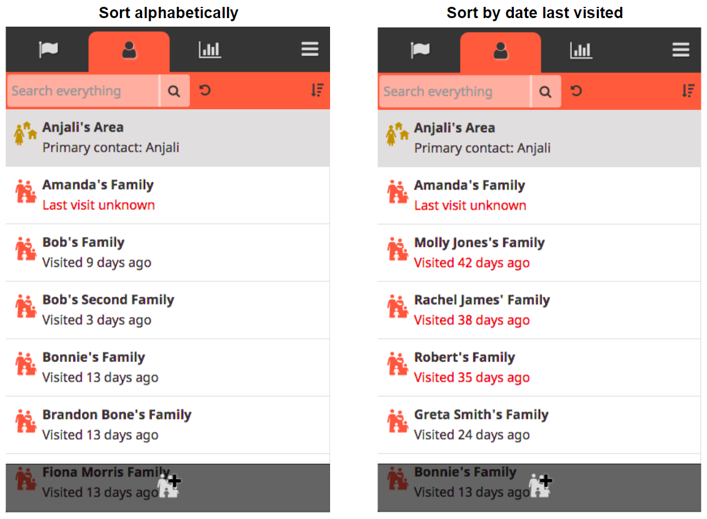

[#4524](https://github.com/medic/medic-webapp/issues/4524)

### Toggle Universal Health Coverage mode on and off

_We're not trying to play bi-partisan politics, we're just trying to test some new features._

Showing the date last visited and being able to sort contacts by the date they were last visited by a CHW are the first two features designed to achieve Universal Health Coverage (UHC). While the world is quickly catching onto the importance of this, we know that not all programs are ready to implement this approach. Feature #4525 makes it possible to turn these UHC features on or off. It's still very early in our UHC design process so we'll be closely monitoring these features and conduct feedback sessions, so the UHC features previously described may still undergo some iteration. Check on the status of these features before implementing them in your project.

[As was described earlier](#view-date-last-visited-for-places-on-the-people-tab), enabling UHC mode is as simple as giving a user the permission `can_view_last_visited_date`. This will give the user the last visit date in the people list and the ability to sort by the last visit date. Make sure you add the needed field to the forms you want to include as part of the last visit date calculation to avoid having a long list of "Last visit unknown". Once CHWs start submitting these forms, the dates on the list will slowly update.

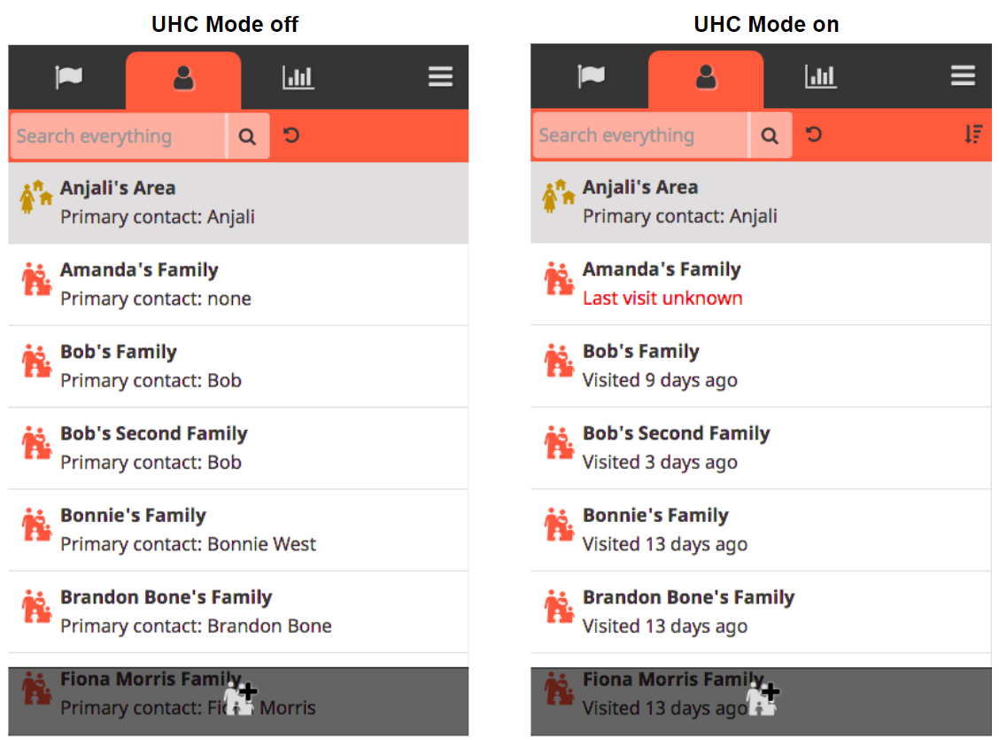

[[#4525](https://github.com/medic/medic-webapp/issues/4525)]

### Expand use of the verify button for manager review of CHW reports

_The exciting world of data cleaning just got better._

We've created a new and improved verification workflow for managers. Before, we just had two states for each report, verified and unverified. A report was verified by clicking the verify button.

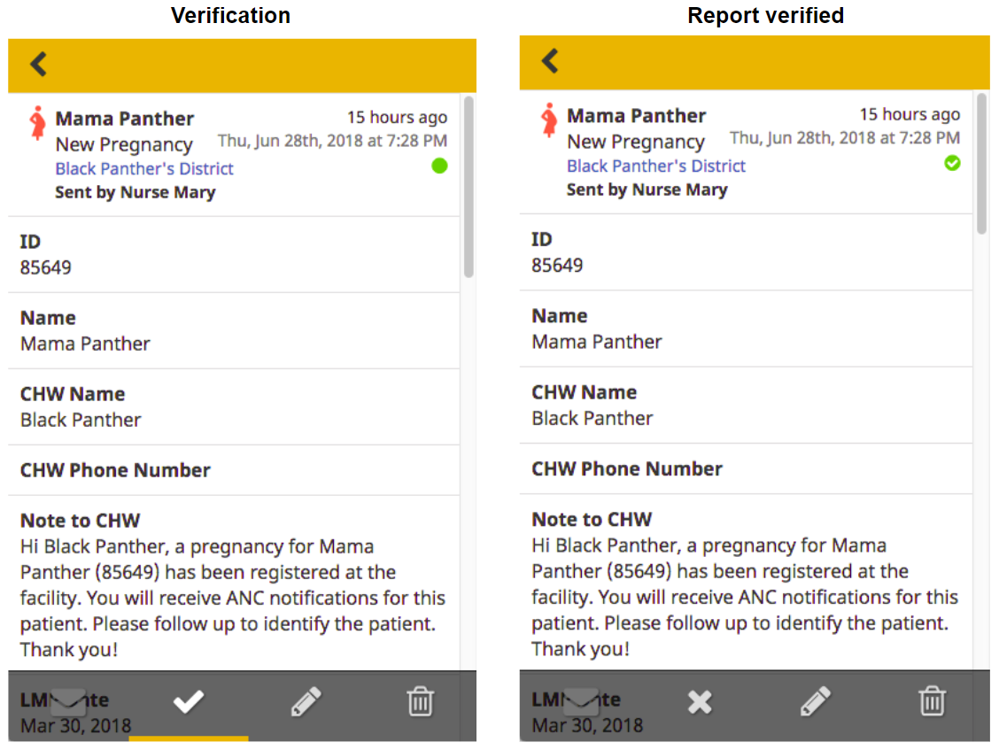

With the new feature, clicking on the verify button opens a small menu with two options: Correct and Has errors. This allows a manager to review a report and mark it correct if it looks good and mark it as having errors if they need to follow up with the CHW for further verification. The status will also be synced to the CHW's phone so they can see which reports were marked correct by their manager and which were marked as having errors. 

[With our new configurable roles](#ability-to-add-more-user-roles), it is also possible for managers to have the ability to review reports while preventing CHWs from having this option, even if both are restricted/offline-first users.

This feature was built to support the mRDT error-checking workflow for the Muso Innovation Network. Supervisors must log in to view photos of the mRDTs ([built in 2.14.0](https://docs.google.com/document/d/1uXSqntenhxlGOeFtP7ScLcFmoid3kagPYn-EDoodP3s/edit#heading=h.4bwl8oo2mtpi)) and check that the diagnosis reported by the CHW matches the photos. If the supervisor sees an error, they can now use this feature to mark it as such. Error rates are part of the CHW's performance metrics so supervisors can see which CHWs are in need of additional training on implementing mRDTs. To complement this workflow, we built a widget on the CHP's Targets page to accompany this workflow that tracks their monthly error rate. 

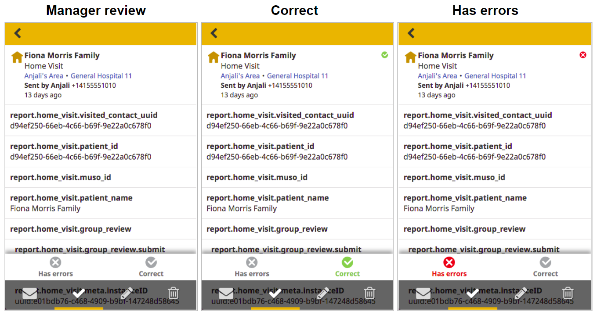

[[#4529](https://github.com/medic/medic-webapp/issues/4529)]

### Allow supervisors to review specific patient reports

_We call this feature Super-Vision! Supervisors now have the magical ability to see reports about patients without being able to view the patients themselves. #superpowers-for-supervisors_

Apart from Standard, where we have very small numbers of users, supervisors are not able to view all patient reports due to device storage limits and app performance issues. However, there may be times when there are specific reports about patients that supervisors need to see, review, or take action on. This feature is not meant to allow supervisors to view all patient reports about every patient and it does not give supervisors the ability to see patient profiles. It is meant to better support workflows like reviewing mRDT images or confirming death reports. Currently, if a supervisor wanted to review an mRDT image in a patient assessment form or get a death confirmation task, she would need to have access to the patient. With this new feature, the supervisor only needs access to the patient assessment form or the death report form in order to do the review or receive the task.

Below you'll see the Reports page from the supervisor's view. In this example, the supervisor has access to families and family reports, but does not have access to patients. Using this feature, we've configured it so that the supervisor **does** have access to patient assessment forms so that they can be reviewed, even though she doesn't have access to the patients themselves. As you can see in the screenshots below, the CHW has access to all patient- and family-level reports while the supervisor has access to all family-level reports AND the patient assessment report, but no other patient-level reports.

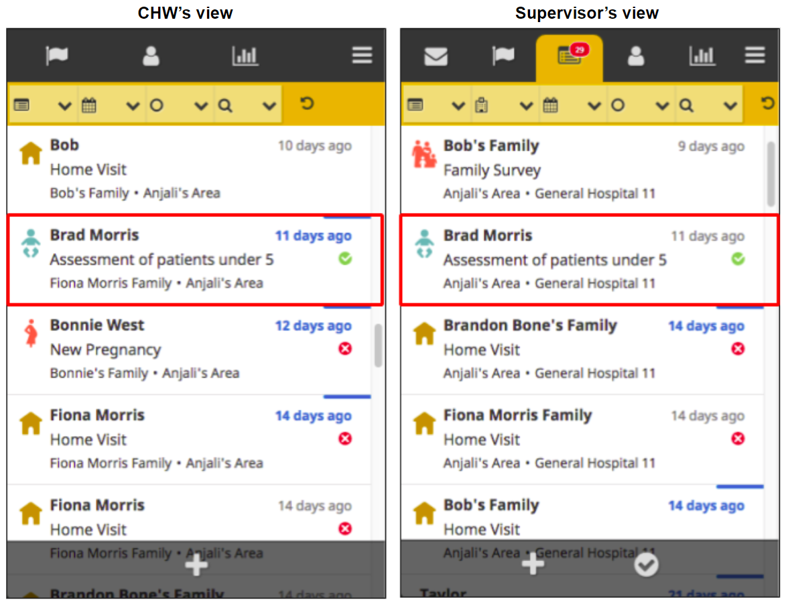

If you want a report submitted by the CHW about a patient to be viewable by the supervisor, you'll need to make sure that the supervisor has access to families (`replication_depth` of 2 in most cases) but no access to patients. You will also need to add a field to the patient-level form that the supervisor needs access to. The field should be a `hidden` field called `needs_signoff` that must be set to true in cases where the report needs to be reviewed by a manager. For example, if you only wanted a manager to review patient assessments where an mRDT was conducted, come up with a conditional statement to set the variable to true only for assessments where the mRDT was done. This hidden field must be a top-level field (not in any group and will be in `doc.fields.needs_signoff` when you submit). To test, upload your form with this field, fill it out and submit. Log in as a user who is the supervisor of the CHW who submitted the form and make sure you are able to see the form you just submitted.

Example XLSForm:
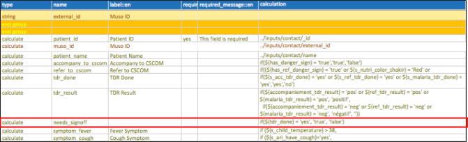

[[#4591](https://github.com/medic/medic-webapp/issues/4591)]

### Add new statuses to the status filter on the reports page

_Because even Superheros could use some help organizing their Inbox._

With the [new feature that allows managers to review reports](#expand-use-of-the-verify-button-for-manager-review-of-chw-reports), we've updated the status filter to help managers easily find reports they need to review or reports they marked as having errors that need follow up. With these changes, we have retained the ability to filter by valid and invalid SMS reports. Here's what happens when you select each of these filter options:

*   **Manager review - "Not reviewed":** displays all valid reports (SMS and app) that have not been marked as correct or having errors by a manager
*   **Manager review - "Reviewed: errors":** displays all reports (app or SMS) that were marked as having errors by a manager
*   **Manager review - "Reviewed: correct":** displays all reports (app or SMS) that were marked as correct by a manager
*   **SMS validity - "Valid SMS":** displays all SMS reports that were valid when received (regardless of whether they are "Not reviewed", "Reviewed: errors", or "Reviewed: correct")
*   **SMS validity - "Invalid SMS":** displays all SMS reports that were invalid when received and have red dots (applied automatically)

For example, if a manager wanted to review any recent patient assessments that they might have access to, she would filter by the patient assessment form type and the "Manager review - Not reviewed" status filter. This would give  a list of assessment forms that have not yet been reviewed.


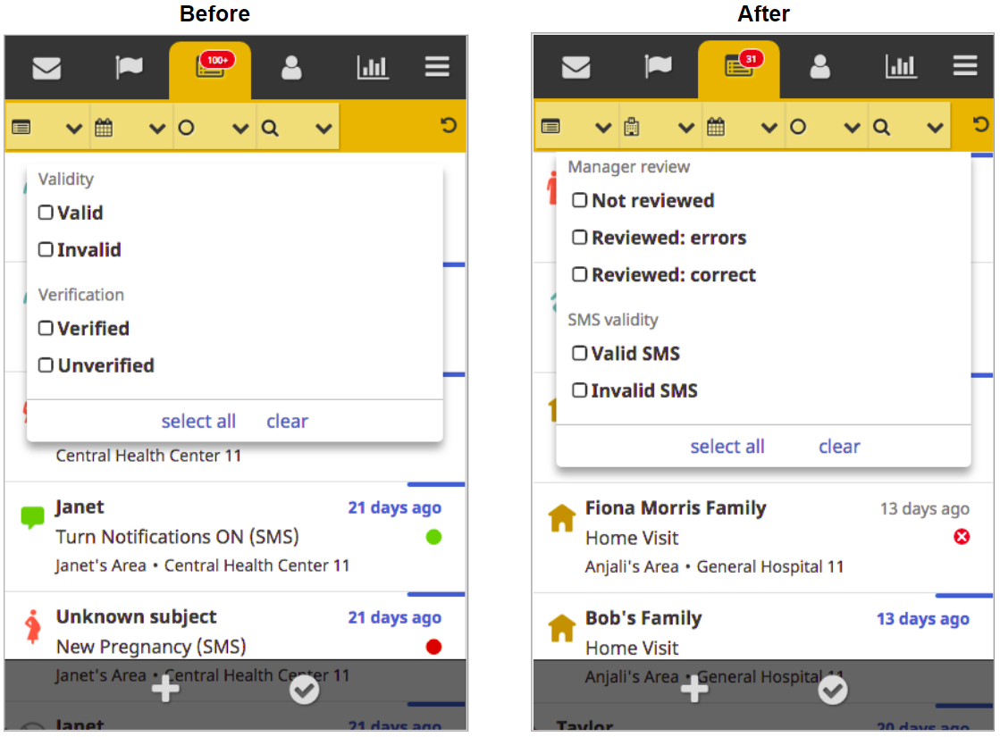

#### Before
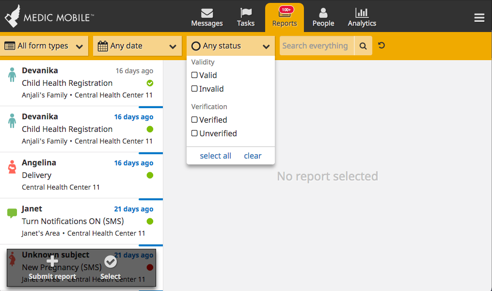

#### After
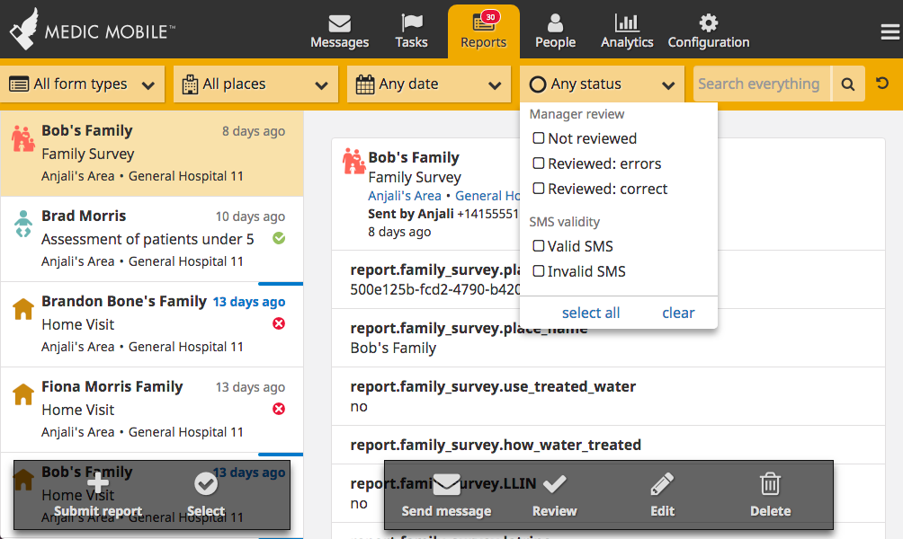

[[#4577](https://github.com/medic/medic-webapp/issues/4577)]

### Use family equity score in tasks and actions about family members

_Jokes aside, this features is an important step in being able to deliver a preferential option for the poor. Read more about this here: [https://www.pih.org/article/in-the-company-of-the-poor](https://www.pih.org/article/in-the-company-of-the-poor)_

Last year, we began implementing an equity survey in Kenya that determines a household's wealth quintile based on a number of questions about their home, possessions, and access to safe drinking water, among other things. Although the wealth quintile could be used to generate tasks for the household, we wanted to make the equity quintile useful in targeting interventions at the patient level. With this feature, we're now able to use the equity score to generate specific tasks about patients, such as increasing the number of pregnancy follow-ups for women in poorer households. We're also able to display specific notes or questions within forms for patients in lower wealth quintiles, such as asking additional questions about children in poorer households when they are being screened for malnutrition. This feature makes the equity score more usable in patient workflows and is the first step toward greater targeting of services.

We're still learning how to deliver this feature well. We've heard from CHWs that they resist the approach that some families in their community would be "labeled" as poor in the app, even if they acknowledge that they prioritize these families differently in their daily workflows. Though this feature allows that "labeling" to happen on the backend, it may be helpful and important for a CHW to know why a family or patient has been asked these additional questions or given more frequent home visits. The Impact and Design teams are currently getting feedback on appropriate options. Please consult your designer and share back what you're thinking and trying so we can all learn together! 

The feature works by pulling specific fields from a form filled at the family level and copying them to the profile of each family member in the household. For now, we are limited to the national quintile and the urban quintile. We don't pull the raw scores, just the quintiles, which are easier to use in tasks and forms. To make sure your quintiles get copied, simply make sure that you have fields called `NationalQuintile` and `UrbanQuintile` defined as top-level fields in the form you're using at the household level. These must end up at `doc.fields.NationalQuintile` and `doc.fields.UrbanQuintile` for this feature to work correctly.

#### Sample XLSForm
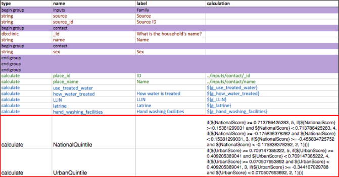

[[#4600](https://github.com/medic/medic-webapp/issues/4600)]

### Ability to add more user roles

_Because CHW Janet, CHW Supervisor Ann, and Paul the Data Guy don't wear the same hat in real life and now they don't have to in the app, either._

In order to make it possible to show the UHC mode features for some CHWs and not others, we decided to go ahead and implement configurable user roles. Up until now, we were limited to one user role for users that need offline access to their data. You have probably heard of the "restricted" user - this is the user type that allowed a CHW or manager to access data offline. However, this was limiting because every user that had offline data access had to have the same set of permissions. So, for example, a CHW and a supervisor had to have the same set of permissions, requiring both to have the  permission to do something (such as delete reports) or neither would have permission to do it. This led to restrictions in what supervisors could do in order to avoid giving too many permissions to CHWs.

With 2.16.0, we now have configurable roles! This means that a CHW and a supervisor can both access data offline but can have unique roles so that they can have different permissions. For example, a CHW might not be able to delete data, review reports, or bulk delete, but a supervisor could be given the ability to do one or more of these actions without affecting the permissions of the CHW.

New roles can be created in the configuration pages. Instead of a permissions page, we now have a roles & permissions page. On this page we have a new tab for creating and managing user roles. Creating a new user role is as simple as creating a name and translation key for the user role and making sure you select the "Offline" checkbox if this user type needs access to data offline.

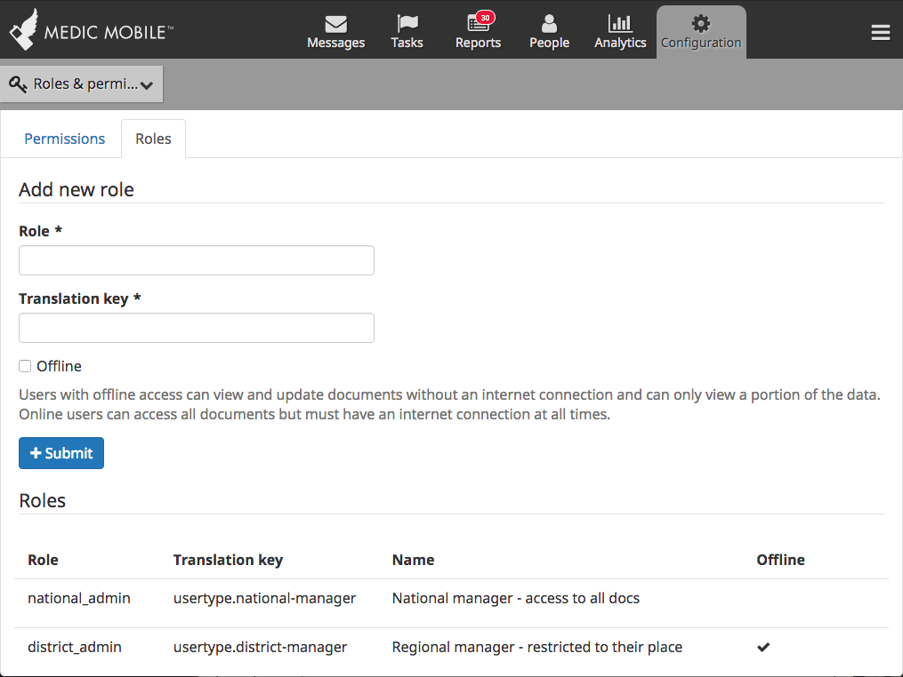

The permissions page has also been updated to better accommodate a greater number of roles. We've changed the layout to a new format. This layout is temporary for now and we expect to improve it later in the year. You can see in this example that we now have roles for Supervisor, CHW and Online User, but you can create as many roles as you need, both for users that need access to data offline and for those accessing the app online.

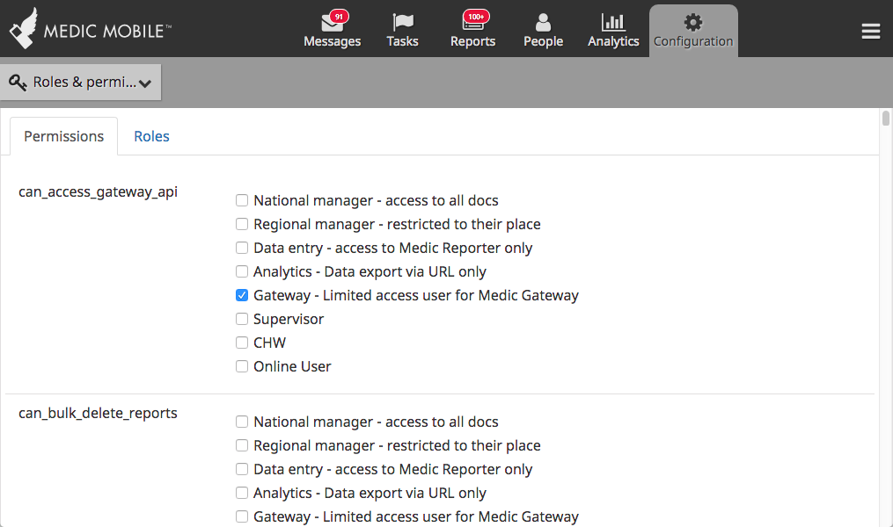

[[#4525](https://github.com/medic/medic-webapp/issues/4525)]

### Changed use of colored dot on the reports page

_Seeing spots? Or do we mean dots? Either way, you're about to see a whole lot less of them. If they don't go away, consult a tech lead or your family eye doctor._

Our use of the controversial "green dot" and "red dot" on the reports page hearkens back to the days when 100% of Medic users where using SMS. It was a quick way to see which reports were valid and which were not. Once we started having users on the mobile app, this feature became less useful because every single report was valid. This is because we have more control over how the data is entered and  do not rely on the end user entering a valid Medic ID. We decided to modernize our use of red and green dots so that they make more sense across our SMS and app projects. Here's our new approach:


*   We've removed the green dot completely from valid incoming reports. No dot = all good here = no attention needed.  This is regardless of whether it came from the mobile app, a TextForm, or Medic Collect. 
*   Without green dots on every report, red and green dots now have more meaning. Using our new manager review feature (#4529), a manager can now use a green dot to indicate that a form is correct, and a red dot if it contains an error.
*   We also know that it's important to be able to see invalid reports coming in over SMS, either TextForms or Collect forms. For these invalid SMS reports, the red dot with an "x" is automatically applied. You can filter to see all invalid SMS reports by using the status filter dropdown. Here's a summary of how the red and green dots now work:

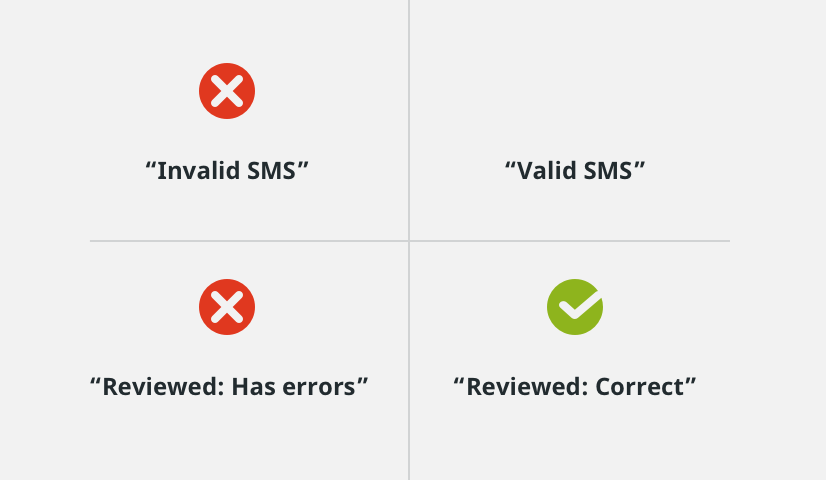

Here's a look at the reports list so you can see the before and after:

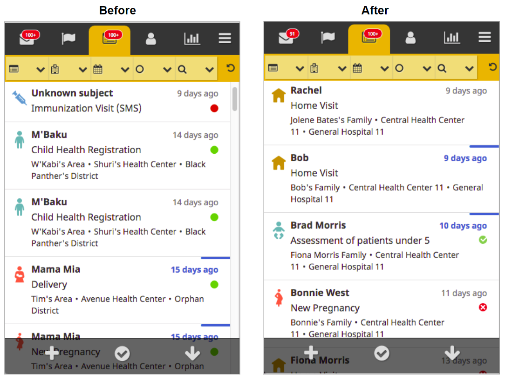

The screenshot on the left shows the current use of dots for an SMS project. On a mobile app project, there's a green dot on every report. 

In the screenshot on the right, we've removed the green dots from valid reports. The green dot can be applied when a supervisor has reviewed a report and marked it correct. The red dot for invalid SMS reports is still automatically applied. Additionally, a supervisor can review a report and apply the red dot if the report has errors.

The supervisor review feature is optional and should only be encouraged if it's part of their workflow. It's also perfectly fine for supervisors to use it selectively - to only mark reports with errors or to only review certain reports (such as mRDT, but not child assessments). The intention isn't to give supervisors more review work but to reduce the noise on the Reports page and make the information that gets shown there more meaningful.

[[#4574](https://github.com/medic/medic-webapp/issues/4574)]

### Updated header for reports

_UI fairy dust alert! We made viewing reports on mobile prettier._

We've updated the header when you're viewing reports in the Reports page. The new design works much better on smaller screens:

*   We've removed the detailed date 
*   We've moved the relative date to the left side, below the sender name. 
*   If you hover over the relative date, the full date and exact time the report was received will appear. If you're on a touchscreen, do a long tap on the relative date to see the detailed date.
*   If a manager has reviewed this report and marked it correct or marked it as having errors, the green or red dot would appear at the top right.

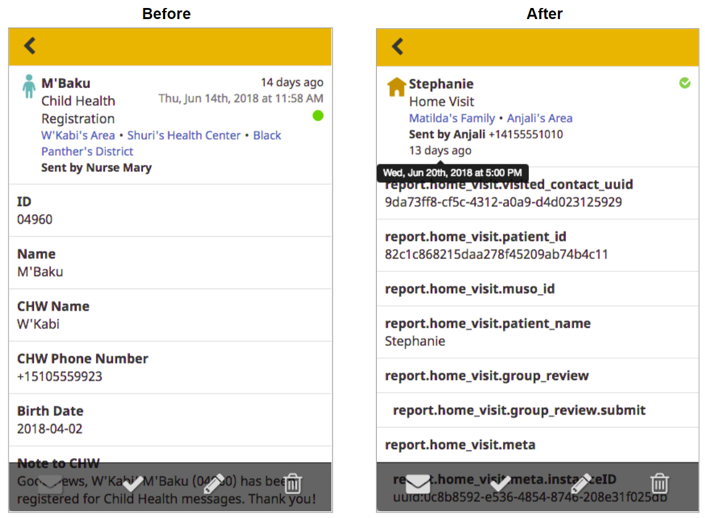

#### Before

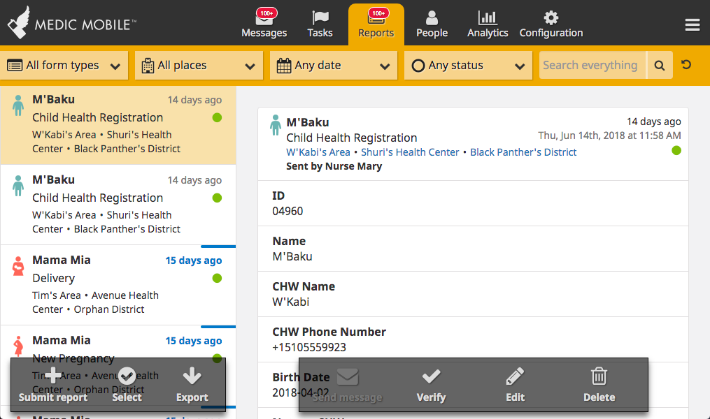

#### After

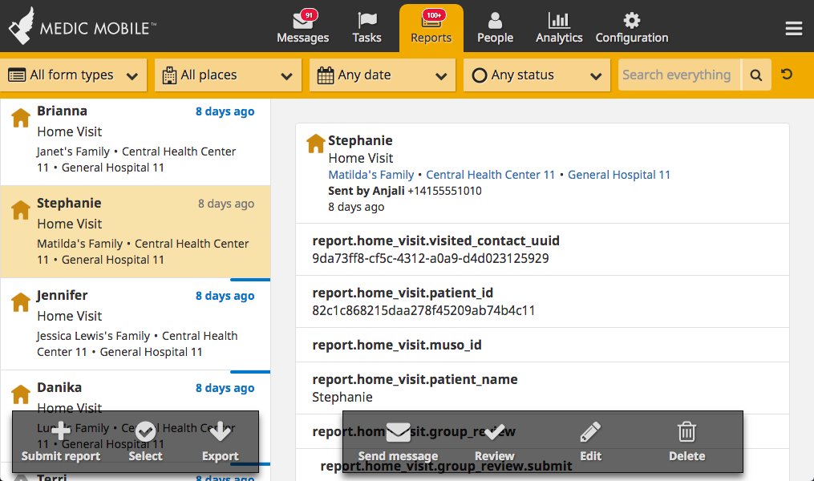

[[#4576](https://github.com/medic/medic-webapp/issues/4576)]

### Allow death confirmation form to specify the date of death

_Because the only thing worse than getting your birthday wrong is…_

In 2.15.0, [we added support for death reporting workflows](./2.15.0.md#death-reporting). One glitch we realized was that the date of death was being set to the date that the death confirmation form was submitted. With 2.16.0, we've added an improvement to the workflow. It's now possible to set a specific date of death in your death confirmation form. This makes the workflow more flexible by allowing a nurse to enter the confirmed date of death in the death confirmation form.

In order to include a user-selected date of death as the official date of death listed in the Medic app, you'll need to make sure there is a field in the death confirmation form that lists the exact date of death and then indicate in your `app_settings` that this field should be used for the date of death.

Example XLSForm with `date_of_death` field:
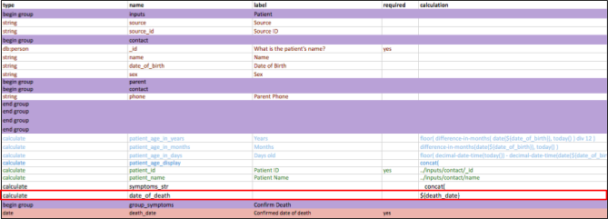

Example `app_settings` configuration:

```
"transitions": {
    "death_reporting": true
},
"death_reporting": {
  "mark_deceased_forms": [
    "death_confirmation"
  ],
  "undo_deceased_forms": [
    "undo_death"
  ],
  "date_field": "fields.date_of_death"
}
```

[[#4636](https://github.com/medic/medic-webapp/issues/4636)]


## Bug Fixes


### Updated google-libphonenumber

_Now you can change your number to avoid your ex without missing a single Medic reminder._

We've updated to the latest google-libphonenumber to make sure our app will accept new phone numbers across all of the countries where we work. The current version is 3.1.8. [[#4665](https://github.com/medic/medic-webapp/issues/4665)]


### Fixed a performance issue with loading contacts


_CHWs see a lot of people every day. That's a lot of searching! We've improved search performance by 30% which really adds up._

Loading contacts is now done with an `allDocs` request instead of using custom views. This improves performance of searching on the people tab and on the reports tab. It's a workaround for now as we look further into the root cause of the slowness. [[#4666](https://github.com/medic/medic-webapp/issues/4666)]