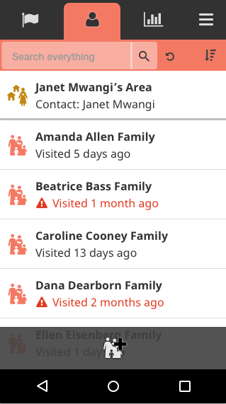

# 2.16.1 Release Notes

## What's New

### Show an icon next to families or areas that are overdue for a visit

_As the ICONic Britney Spears once sang, "Show me a siiiiiign… [visit] me, baby, one more time!"_

In order to help CHWs achieve full coverage of every family or household they care for, we added a feature [in 2.16](https://docs.google.com/document/d/1pPk6FAuLUPKUYnCRgruPk6Lh5IeWzu6IPD1KTFOi6YQ/edit#heading=h.1mauws8bn005) to update the list of families or areas to display the date that family or area was last visited. Now, we've added an icon next to families that were visited more than a month ago to help CHWs quickly spot whom they might visit. Currently, the time frame of "more than a month ago" is not configurable. [[#4747](https://github.com/medic/medic-webapp/issues/4747)]

