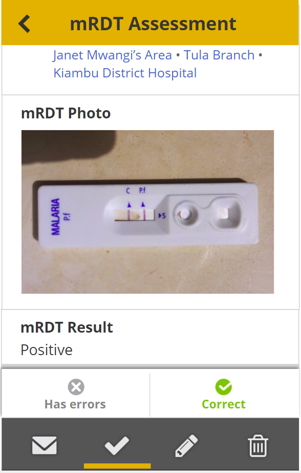
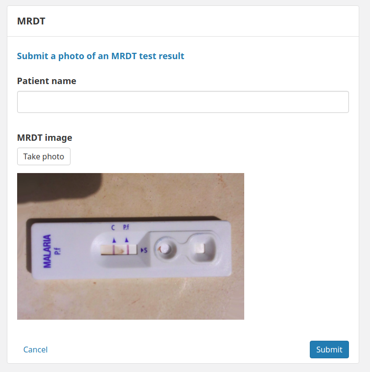

# 2.17.0 Release Notes

- [What's New](#whats-new)
    - [Show pictures in the report view (History tab)](#show-pictures-in-the-report-view-history-tab)
    - [Improve styling of mRDT Enketo widget](#improve-styling-of-mrdt-enketo-widget)
    - [Include mRDT in an android release](#include-mrdt-in-an-android-release)
    - [Include mRDT in a webapp release](#include-mrdt-in-a-webapp-release)

## What's New

### Show pictures in the report view (History tab) 

_Your selfies are safe with us (and now visible in the Reports tab)._

Photos uploaded by CHWs are now visible in the Reports view, or History tab. This is currently being used in the mRDT workflow by supervisors to confirm that CHWs read the mRDT test results correctly. [[#4742](https://github.com/medic/medic-webapp/issues/4742)]

### Improve styling of mRDT Enketo widget

_"OK, but make it pretty." Fine, here you go: ✨ UI fairy dust ✨_

We've improved styling by:
- Moving the "Take Photo" button **above ** where the photo is;
- Adding a space between the photo and the "Take Photo" button;

[[#4745](https://github.com/medic/medic-webapp/issues/4745)]

### Include mRDT in an android release

We made changes in the Android container to make mRDT-related features available. [[#4744](https://github.com/medic/medic-webapp/issues/4744)]

### Include mRDT in a webapp release

We included mRDT-related features in a webapp release. [[#4743](https://github.com/medic/medic-webapp/issues/4743)]
