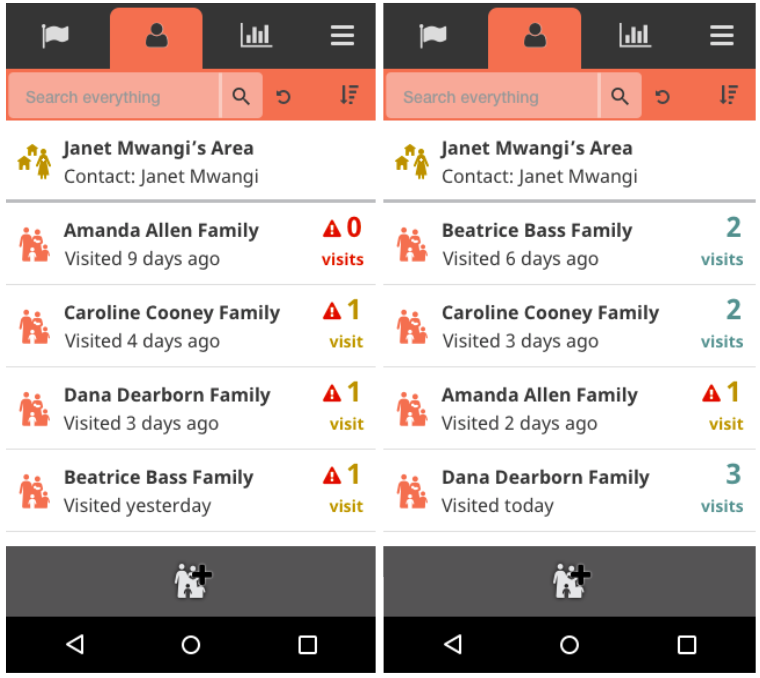

# 2.18.0 Release Notes
- [What's New](#whats-new)
    - [Make People page default sort configurable (UHC mode)](#make-people-page-default-sort-configurable-uhc-mode)
    - [Add display of visit counts and conditionally style them (UHC mode)](#add-display-of-visit-counts-and-conditionally-style-them-uhc-mode  )
- [Improvements](#improvements)
    - [LHS list doesn't update "out of page" items](#lhs-list-doesnt-update-out-of-page-items)
    - [There are view generation errors](#there-are-view-generation-errors)

## What's New

### Make People page default sort configurable (UHC mode)

Previously, the default sort for the People page list was alphabetical. We've now made the default sort configurable. For UHC mode, this would likely mean sorting by last visited date. In the future, it could include sorting by number of visits this month or another value.

To enable default contact sorting to be based on last visited date, you need to configure it in app_settings. [Please visit the following documentation in medic-docs to learn how](https://github.com/medic/medic-docs/blob/master/configuration/app-settings.md). [[#4752](https://github.com/medic/medic-webapp/issues/4752)]

### Add display of visit counts and conditionally style them (UHC mode)

We added visit count numbers to the right side of each family row. The visit count will display a count of the number of times that family has been visited so far within the current month. The exact definition of the calendar month is configurable. This is because some partners may follow the Western calendar literally, while other partners have different definitions of a month (ex: Muso counts from the 26th of one month until the 25th of the next month). Whatever forms have been configured to calculate "Date last visited" will be the same forms used to calculate "Visits this month." Please note this will be a straightforward count of forms submitted and cannot be configured to only include a max number of forms in a particular time frame, such as "per day."

These visit counts are also available to be conditionally styled. If the partner has no specific goals, just like with Targets, the text is normal black. If the partner does have specific goals, we use red to indicate "bad", yellow to indicate "ok" and green to indicate "good" or "goal met." It is also possible to display an icon next to the count number. This icon is only available as an option if the partner has a goal. If the partner does not have a goal, there will never be an icon. The icon is positioned to the left of the count number on the same baseline.

Note: We removed the red warning icon by the date last visited text that we implemented in 2.16.1. The new functionality and location of the icon as described here replaces what we did in 2.16.1. It used to be tied to date last visited. It is now tied to visits this month.

To enable the specific goal (which color codes the number of visits), you need to configure it in app_settings. [Please visit the following documentation in medic-docs to learn how](https://github.com/medic/medic-docs/blob/master/configuration/app-settings.md#optional-settings). [[#4758](https://github.com/medic/medic-webapp/issues/4758)]

## Improvements

### LHS list doesn't update "out of page" items

LiveList and Search webapp services previously did not support sorting items by fields/values that are likely to change (e.g. by last visited date). Now, when the list is multiple pages long and it's not entirely loaded, if an existent item receives a change that would push it lower than the current number of loaded items, it will refresh and move to appropriate position in the list. [[#4782).](https://github.com/medic/medic-webapp/issues/4782)]

### There are view generation errors
[[#4612](https://github.com/medic/medic-webapp/issues/4612)]
