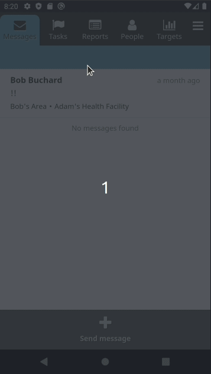
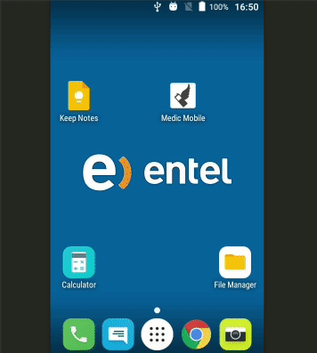
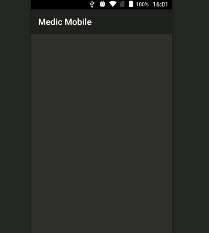
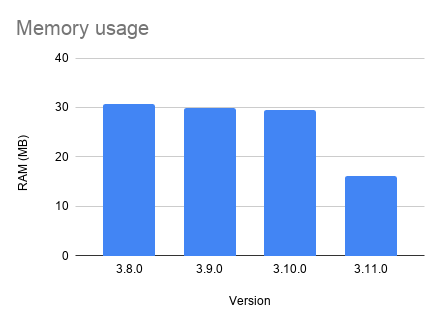
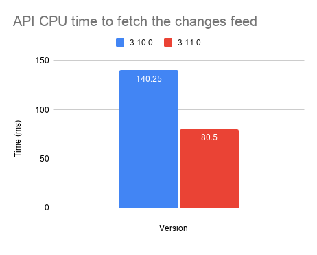

# 3.11.0 Release Notes

- [Known issues](#known-issues)
- [Upgrade notes](#upgrade-notes)
- [Breaking changes](#breaking-changes)
- [Supported software](#supported-software)
- [Highlights](#highlights)
- [And more...](#and-more)

## Known issues

- [medic-android#127](https://github.com/medic/medic-android/issues/127): Image upload forms crash the app. This has been broken for some time and is not easy to fix while supporting Android 4.4 so the resolution has been deferred until we can make this breaking change. Reach out if you require this feature in the near future.

## Upgrade notes

- This upgrade can be rolled out remotely. Users will download the new version in the background and be prompted to reload the app when it's ready. A small amount of data will be needed to download the new version.
- Upgrading to this version does not require other applications to be upgraded. This release does not drop support for any hardware or software that works with the previous version.
- This release modifies some CouchDB view definitions so we recommend you Stage the upgrade and wait for the views to be rebuilt before rolling it out to minimize downtime.
- It is recommended to test the upgrade on a clone of your server first to ensure it works well for your application.

### Breaking changes

#### Removal of Reporting Rates feature

This feature wasn't documented or tested and hasn't been used in production for some time so it has been removed. To read more about this feature or if this breaking change affects you, read this [forum post](https://forum.communityhealthtoolkit.org/t/feature-removal-proposal-reporting-rates/1053).

- [cht-core#6248](https://github.com/medic/cht-core/issues/6248): Remove the Reporting Rates feature

### UI/UX changes

#### Android app

A few UI/UX changes were made to the medic-android app. It is safe to ignore this section if you are not updating android app right now.

##### Add UI for prominent disclosure when requesting permissions

The app will now require a one time authorization from the user to enable access to location information. This was required to comply with the latest Google Play Store requirements.

- [medic-android#136](https://github.com/medic/medic-android/issues/136) 

##### Improve connection errors UX

If the user does not have a connection the first time the app is opened they will now see a user friendly error message with a retry button.

- [medic-android#163](https://github.com/medic/medic-android/issues/163)

##### Improve UX of crosswalk to webview migration

When migrating data from a Crosswalk apk to a Webview apk the user is now guided through the migration process so it can be upgraded without support. The migration was introduced in 0.6.0 for Android 10 and 11 devices to maintain compliance with Google Play Store policies. Read more about the transition to webview in this [previously released issue](https://github.com/medic/medic-android/issues/106).

- [medic-android#134](https://github.com/medic/medic-android/issues/134)

### Supported software

There are no required changes to the [supported software matrix](https://docs.communityhealthtoolkit.org/core/overview/supported-software/) from `3.0.0`.

| Node | CouchDB | Browsers | SMS bridge | Android | medic-android | medic-couch2pg |
|----|----|----|----|----|----|---|
| 8.11+ | 2.1+ | Chrome 53+, Firefox latest | medic-gateway | 4.4+ | 0.4.5+ | 3.0+ |

## Highlights

### Angular upgrade

The UI framework has been upgraded from the deprecated AngularJS v1.6 to Angular v10.0 which drastically reduces the memory used on the phone. It will make development of the Core Framework easier and more reliable and also makes it easier to keep on the latest version of Angular which means we can keep up to date and on a supported version from now on.

- [cht-core#4750](https://github.com/medic/cht-core/issues/4750): Move to Angular latest

### RapidPro SMS gateway

SMS messages can now be sent and received using a RapidPro instance. This allows for integration with a wide range of SMS aggregators for a high scale SMS deployment. Learn more in the [feature documentation](https://docs.communityhealthtoolkit.org/apps/guides/messaging/rapidpro).

- [cht-core#6532](https://github.com/medic/cht-core/issues/6532): Add RapidPro as an SMS Gateway

### Improved replication performance

API CPU usage has been significantly improved when requesting the changes feed, which is a frequently requested endpoint for smartphone applications.

- [cht-core#6577](https://github.com/medic/cht-core/issues/6577): Improve performance of subject lookups in authorization service

### Added a GitHub Action for deploying configuration

If you wish to automate configuration deployment you can now use our GitHub Action as a building block.

- [cht-core#6758](https://github.com/medic/cht-core/issues/6758): Re-usable GitHub action for deploying configurations via medic-conf

## And more...

### Features

- [cht-core#6532](https://github.com/medic/cht-core/issues/6532): Add RapidPro as an SMS Gateway
- [cht-core#6758](https://github.com/medic/cht-core/issues/6758): Re-usable GitHub action for deploying configurations via medic-conf

### Improvements

- [cht-core#6251](https://github.com/medic/cht-core/issues/6251): Add a way to discover users who are replicating too many docs
- [cht-core#6292](https://github.com/medic/cht-core/issues/6292): Make changing your password less jarring
- [cht-core#6376](https://github.com/medic/cht-core/issues/6376): Validate env variables, better handling of CouchDB down when starting API / Sentinel
- [cht-core#6444](https://github.com/medic/cht-core/issues/6444): Support submission of forms for places in SMS
- [cht-core#6489](https://github.com/medic/cht-core/issues/6489): Migrate all medic-docs references
- [cht-core#6693](https://github.com/medic/cht-core/issues/6693): Improve 3.10 release notes with compatibility matrix between android 0.5 and cht-core 3.10
- [couch2pg#20](https://github.com/medic/couch2pg/issues/20): Switch to GitHub Actions
- [medic-android#134](https://github.com/medic/medic-android/issues/134): Improve UX of crosswalk to webview migration
- [medic-android#163](https://github.com/medic/medic-android/issues/163): Improve connection errors UX, especially for the XWalk-Webview migration process
- [medic-conf#167](https://github.com/medic/medic-conf/issues/167): Allow configuring of whitelabelling options
- [medic-conf#214](https://github.com/medic/medic-conf/issues/214): Make app_settings more modular
- [medic-conf#254](https://github.com/medic/medic-conf/issues/254): Add validation to the upload custom translations function
- [medic-conf#269](https://github.com/medic/medic-conf/issues/269): Warn about deprecated transitions when uploading app-settings
- [medic-conf#64](https://github.com/medic/medic-conf/issues/64): Before pushing config check if the git repo needs a pull or a push
- [medic-couch2pg#67](https://github.com/medic/medic-couch2pg/issues/67): Upgrade CI to use Github Actions
- [medic-gateway#135](https://github.com/medic/medic-gateway/issues/135): Remove wifi resetting feature as it doesn't work as expected
- [medic-gateway#142](https://github.com/medic/medic-gateway/issues/142): Mark messages as received-by-gateway so they are not included in the next response 

### Security issues

- [cht-core#6120](https://github.com/medic/cht-core/issues/6120): Add permission control for sentinel access
- [cht-core#7023](https://github.com/medic/cht-core/issues/7023): Outbound push may log user and password

### Performance fixes

- [cht-core#3869](https://github.com/medic/cht-core/issues/3869): Remove D3 library from JS bundle as it's no longer used
- [cht-core#4750](https://github.com/medic/cht-core/issues/4750): Move to Angular latest
- [cht-core#6577](https://github.com/medic/cht-core/issues/6577): Improve performance of subject lookups in authorization service

### Bug fixes

- [cht-core#6139](https://github.com/medic/cht-core/issues/6139): Hyperlinks to tasks don't load the task in the url
- [cht-core#6385](https://github.com/medic/cht-core/issues/6385): Error when editing scheduled message from webapp
- [cht-core#6387](https://github.com/medic/cht-core/issues/6387): Error when selecting incoming message from deleted contact
- [cht-core#6447](https://github.com/medic/cht-core/issues/6447): Upgrade UI only considers URLS ending in "app.medicmobile.org" as production
- [cht-core#6533](https://github.com/medic/cht-core/issues/6533): Sentinel might process changes when it shouldn't
- [cht-core#6557](https://github.com/medic/cht-core/issues/6557): API service doesn't boot successfully if there is a label named "submission" in the xform
- [cht-core#6591](https://github.com/medic/cht-core/issues/6591): Replication of meta data does not occur when the regex doesn't match
- [cht-core#6611](https://github.com/medic/cht-core/issues/6611): Exporting should be available to all online roles
- [cht-core#6627](https://github.com/medic/cht-core/issues/6627): Bug causing feedback "Duplicates in a repeater are not allowed"
- [cht-core#6629](https://github.com/medic/cht-core/issues/6629): Feedback documents are not created when contact-summary crashes
- [cht-core#6648](https://github.com/medic/cht-core/issues/6648): Blank screen when launching external apps from CHT Android app
- [cht-core#6663](https://github.com/medic/cht-core/issues/6663): Type error when running remove_non_admin_users script
- [cht-core#6700](https://github.com/medic/cht-core/issues/6700): For targets without `idType`, the winning emission is not deterministic
- [cht-core#6711](https://github.com/medic/cht-core/issues/6711): Form submissions hang in desktop browsers when location permission requests are ignored by users
- [cht-core#6811](https://github.com/medic/cht-core/issues/6811): Targets with property "passesIfGroupCount.gte" count intances with "pass: false" when aggregating
- [cht-core#6814](https://github.com/medic/cht-core/issues/6814): Document update conflicts deleting reviewed report
- [cht-core#6835](https://github.com/medic/cht-core/issues/6835): Android app version and Server URL not showing in About page
- [cht-core#6839](https://github.com/medic/cht-core/issues/6839): Race condition in rules engine / task list interaction can result in a stale tasks list
- [cht-core#6920](https://github.com/medic/cht-core/issues/6920): Users might start upwards replication from 0 after upgrade
- [cht-core#6993](https://github.com/medic/cht-core/issues/6993): Patients with `type: 'person', contact_type: 'other'` don't have tasks appear when viewed on the contacts tab
- [cht-core#6996](https://github.com/medic/cht-core/issues/6996): Muting transition and update clinics don't handle contacts that use a hardcoded type and also have a `contact_type` property correctly
- [cht-core#7022](https://github.com/medic/cht-core/issues/7022): In the form's `context.expression` the `summary` parameter is always undefined
- [cht-core#7035](https://github.com/medic/cht-core/issues/7035): Handle compiled messageformat translations throwing errors with missing translation params
- [cht-core#7037](https://github.com/medic/cht-core/issues/7037): SMS recipients might not be mapped correctly when using places as subjects
- [cht-core#7041](https://github.com/medic/cht-core/issues/7041): Loading places fails when using an offline user and the place has a primary contact that is not a child
- [medic-android#136](https://github.com/medic/medic-android/issues/136): Add UI for prominent disclosure when requesting for permissions
- [medic-android#91](https://github.com/medic/medic-android/issues/91): Failure to upload APKs to Play Store prevents APKs being published to GitHub
- [medic-conf#164](https://github.com/medic/medic-conf/issues/164): Declarative config appliesToType is indicated as optional for fields and cards but we do require them
- [medic-conf#331](https://github.com/medic/medic-conf/issues/331): Validate xforms before uploading
- [medic-conf#345](https://github.com/medic/medic-conf/issues/345): Warn config overwrite falsely alerts about changes when uploading certain types of attachments
- [medic-conf#358](https://github.com/medic/medic-conf/issues/358): Can't create task action with type "contact"
- [medic-conf#377](https://github.com/medic/medic-conf/issues/377): Incorrect warning when specifying hidden_fields
- [medic-conf#387](https://github.com/medic/medic-conf/issues/387): Can't upload-app-settings on Node lower than 12
- [medic-couch2pg#42](https://github.com/medic/medic-couch2pg/issues/42): Node 10 build fails a lot in a flakey way
- [medic-couch2pg#54](https://github.com/medic/medic-couch2pg/issues/54): Add ability to replicate medic-users-meta database to PostgreSQL
- [medic-couch2pg#61](https://github.com/medic/medic-couch2pg/issues/61): Update contactview_metadata to be compatible with configurable contact hierarchies
- [medic-gateway#139](https://github.com/medic/medic-gateway/issues/139): Don't mark messages as permanently failed unless they are irredeemable
- [medic-gateway#154](https://github.com/medic/medic-gateway/issues/154): SMSs are stuck in PENDING state after being successfully sent

### Technical issues

- [cht-core#5993](https://github.com/medic/cht-core/issues/5993): Analyse partners telemetry closely
- [cht-core#6100](https://github.com/medic/cht-core/issues/6100): Modal service throws unhandled rejection
- [cht-core#6196](https://github.com/medic/cht-core/issues/6196): Publish openrosa-xpath-evaluator release
- [cht-core#6248](https://github.com/medic/cht-core/issues/6248): Remove the Reporting Rates feature
- [cht-core#6327](https://github.com/medic/cht-core/issues/6327): Refactor the way we deal with asynchronous loading tasks in webapp
- [cht-core#6490](https://github.com/medic/cht-core/issues/6490): Guard against xpath string concatenation regression
- [cht-core#6510](https://github.com/medic/cht-core/issues/6510): Add entries to .gitignore so it ignores medic-conf files
- [cht-core#6605](https://github.com/medic/cht-core/issues/6605): Token login e2e test should redirect the user to the app if already logged in
- [cht-core#6614](https://github.com/medic/cht-core/issues/6614): Find a better way to patch the webdriver version to build against
- [cht-core#6616](https://github.com/medic/cht-core/issues/6616): Update `admin` to be a standalone app
- [cht-core#6632](https://github.com/medic/cht-core/issues/6632): Be able to run unit tests from different apps in the CHT
- [cht-core#6728](https://github.com/medic/cht-core/issues/6728): Add documentation for demo-forms about how to load forms into CHT
- [cht-core#6829](https://github.com/medic/cht-core/issues/6829): CI failing due to TooManyPullReuqests from docker
- [cht-core#6901](https://github.com/medic/cht-core/issues/6901): CI build failing due to couchdb:2 is not available on dockerhub
- [cht-core#7000](https://github.com/medic/cht-core/issues/7000): Update CI build cleanup script 
- [cht-core#7025](https://github.com/medic/cht-core/issues/7025): PR Builds are failing for external contributors
- [medic-android#106](https://github.com/medic/medic-android/issues/106): Update target SDK version to 29
- [medic-android#129](https://github.com/medic/medic-android/issues/129): Convert CI from travis to GitHub Actions
- [medic-android#137](https://github.com/medic/medic-android/issues/137): Improve release notes with details of v0.6 upgrade recommendations
- [medic-android#138](https://github.com/medic/medic-android/issues/138): Branded signed APKs are no longer available
- [medic-conf#367](https://github.com/medic/medic-conf/issues/367): Convert CI from travis to GitHub Actions
- [medic-gateway#156](https://github.com/medic/medic-gateway/issues/156): Document and solve upgrade path issues
