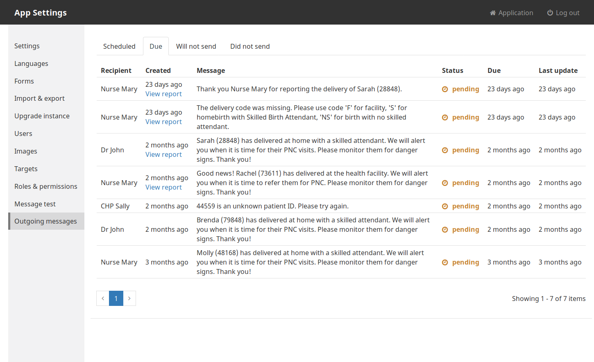
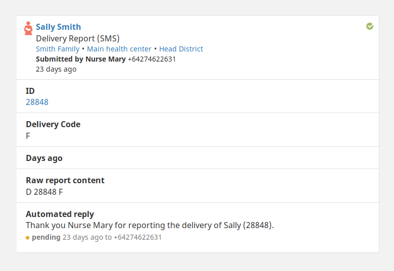

# 3.3.0 Release Notes

- [Upgrade notes](#upgrade-notes)
- [Purging](#purging)
- [Outgoing messages screen](#outgoing-messages-screen)
- [Smarter outgoing phone number validation](#smarter-outgoing-phone-number-validation)
- [ISO week validation](#iso-week-validation)
- [Better memory management](#better-memory-management)
- [Link reports to patients](#link-reports-to-patients)
- [And more...](#and-more)

## Upgrade notes

There are no breaking changes when upgrading from 3.2.x.

## Purging

Documents on phones can now be deleted once no longer useful. This allows for space on the device to be recovered and improves performance. Read the [configuration documentation](https://github.com/medic/medic-docs/blob/master/configuration/purging.md) for how to add script to indicate that a document is no longer useful and is ready for purging. [[#5048](https://github.com/medic/medic-webapp/issues/5048)]

## Outgoing messages screen

Administrators can now see all outgoing messages that are either scheduled, due, or unable to be sent. This is useful for monitoring the status of your SMS gateway and checking up on messages that have errored. [[#649](https://github.com/medic/medic-webapp/issues/649)]

## Smarter outgoing phone number validation

For a long time it has been possible block outgoing messages being sent to a configured list of phone numbers. This is really useful for stopping messages to carriers and other automated systems that can cause messaging loops using up all your credit.

In 3.3.0 we have expanded on this feature to allow blocking of sending to phone numbers shorter than a certain length or recipients that only contain letters. These have been enabled by default so by upgrading your system will no longer SMS short or non-numeric recipients. For more information read the [configuration documentation](https://github.com/medic/medic-docs/blob/master/configuration/app-settings.md#optional-settings). [[#3675](https://github.com/medic/medic-webapp/issues/3675)]

## ISO week validation

SMS forms can now validate ISO week fields for a given year using the built in `isISOWeek` rule function. For more information read the [configuration documentation](https://github.com/medic/medic-docs/blob/master/configuration/app-settings-validations.md#medic-mobile-validation-functions). [[#3155](https://github.com/medic/medic-webapp/issues/3155)]

## Better memory management

A bug in Node was causing the API service to consume more and more memory eventually causing Node to crash. [[#5255](https://github.com/medic/medic-webapp/issues/5255)]

## Link reports to patients

When viewing a report about a patient the ID now links to the patient record so you can easily access more information. [[#3414](https://github.com/medic/medic-webapp/issues/3414)]

## And more...

### Improvements

- [#670](https://github.com/medic/medic/issues/670): Outgoing message size is not limited
- [#3705](https://github.com/medic/medic/issues/3705): Disable 'Select' and 'Export' buttons when there are no reports
- [#4013](https://github.com/medic/medic/issues/4013): Add warning dialogue when users navigate away from a form
- [#4097](https://github.com/medic/medic/issues/4097): Log each valid `POST /api/v1/users/{username}` with field names
- [#4294](https://github.com/medic/medic/issues/4294): On single column pages, remove scroll within a scroll
- [#4680](https://github.com/medic/medic/issues/4680): Translate our startup messages for non-English speakers
- [#4895](https://github.com/medic/medic/issues/4895): Update place icons
- [#5224](https://github.com/medic/medic/issues/5224): Translations for new bootstrapper states added by purging
- [#5246](https://github.com/medic/medic/issues/5246): Pass user context to the purge function

### Performance fixes

- [#4644](https://github.com/medic/medic/issues/4644): Use asynchronous logging in node apps
- [#4834](https://github.com/medic/medic/issues/4834): Move `medic-client/feedback` view into admin ddoc
- [#5076](https://github.com/medic/medic/issues/5076): PouchDB replication `_bulk_get` requests are no longer batched

### Bug fixes

- [#3327](https://github.com/medic/medic/issues/3327): Date picker widget is not translated
- [#3391](https://github.com/medic/medic/issues/3391): Not all writes to CouchDB go through the audit layer
- [#3427](https://github.com/medic/medic/issues/3427): medic-api forms controller should use appropriate protocol
- [#3707](https://github.com/medic/medic/issues/3707): GET `/api/v1/forms` is broken if trailing slash
- [#3899](https://github.com/medic/medic/issues/3899): Can create people born in the future with standard configuration
- [#4331](https://github.com/medic/medic/issues/4331): Reports incorrectly filtered if filter changes before search returns
- [#4511](https://github.com/medic/medic/issues/4511): Timestamps incorrectly cleared when adding a message to an ANC reminder group
- [#4625](https://github.com/medic/medic/issues/4625): Reports page can mistakenly hide fields
- [#4710](https://github.com/medic/medic/issues/4710): Users without admin permissions can view the configuration area
- [#4711](https://github.com/medic/medic/issues/4711): Users without permission to view contacts, tasks, messages can view those pages
- [#4755](https://github.com/medic/medic/issues/4755): The image upload enketo widget relies on the form name matching the xml instance element
- [#4772](https://github.com/medic/medic/issues/4772): If during user creation associated contact is chosen, 'Place' field has to become required
- [#4787](https://github.com/medic/medic/issues/4787): Editing a report's scheduled message is not working
- [#4788](https://github.com/medic/medic/issues/4788): The report details field titles should line wrap
- [#4800](https://github.com/medic/medic/issues/4800): Horti crashes on subsequent upgrade
- [#4802](https://github.com/medic/medic/issues/4802): Cannot get audit log
- [#4816](https://github.com/medic/medic/issues/4816): Exporting messages doesn't work with reports with scheduled tasks
- [#4825](https://github.com/medic/medic/issues/4825): After searching the RHS should clear of anything you were previously looking at
- [#4829](https://github.com/medic/medic/issues/4829): Unable to access Configuration screen on my local instance of webapp (wrong redirect URL)
- [#4832](https://github.com/medic/medic/issues/4832): Date picker widget is not translated for language Bamanankan (bm)
- [#4837](https://github.com/medic/medic/issues/4837): Font awesome icons not loading in the administration console
- [#4899](https://github.com/medic/medic/issues/4899): Error loading Outgoing Messages tab when there are no results
- [#4905](https://github.com/medic/medic/issues/4905): Contacts controllers search is clearing `$stateParams` when it shouldn't
- [#4942](https://github.com/medic/medic/issues/4942): Fix failing test: "Family Survey form Submit Family Survey form"
- [#4962](https://github.com/medic/medic/issues/4962): The `accept_patient_reports` transition is broken
- [#5045](https://github.com/medic/medic/issues/5045): DOMException crash leaves users stuck at loading spinner
- [#5221](https://github.com/medic/medic/issues/5221): Outgoing messages columns should not wrap on smaller screens
- [#5326](https://github.com/medic/medic/issues/5326): Bootstrap translation doesn't work on first load
- [#5327](https://github.com/medic/medic/issues/5327): The login page is not translated
- [#5348](https://github.com/medic/medic/issues/5348): Handle Database has a global failure error during replication
- [#5395](https://github.com/medic/medic/issues/5395): Optimize the `fix-user-db-security` migration for databases with many users
- [#5414](https://github.com/medic/medic/issues/5414): Unknown replication status/last sync
- [#5417](https://github.com/medic/medic/issues/5417): All reports are highlighted
- [#5420](https://github.com/medic/medic/issues/5420): Optimize deletion of read docs for databases with many users

### Technical issues

- [#4865](https://github.com/medic/medic/issues/4865): grunt watch doesn't deploy inbox.html changes
- [#4955](https://github.com/medic/medic/issues/4955): Bump autoprefixer browser support
- [#4979](https://github.com/medic/medic/issues/4979): Weak passwords should not be used on CouchDB developer boxes
