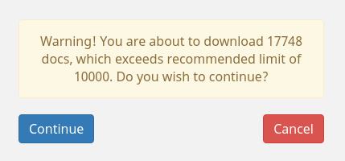
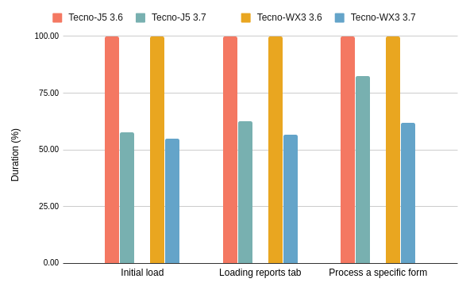

# 3.7.0 Release Notes

- [Known issues](#known-issues)
- [Upgrade notes](#upgrade-notes)
- [Configurable hierarchies](#configurable-hierarchies)
- [Includes a new default configuration](#includes-a-new-default-configuration)
- [Optimised form HTML generation](#optimised-form-html-generation)
- [Improved purging now done server-side](#improved-purging-now-done-server-side)
- [Warn when replicating too many docs](#warn-when-replicating-too-many-docs)
- [Performance](#performance)
- [And more...](#and-more)

## Known issues

None.

## Upgrade notes

### Breaking changes

1. A new OS level dependency (`xsltproc`) is required for generating XFORM `html` on the server.
2. Not fully supported by `medic-conf@2.x`. For full functionality, users must upgrade to `medic-conf@3.x`.  

### Supported software

There are no required changes to the [supported software matrix](https://docs.communityhealthtoolkit.org/core/overview/supported-software/) from `3.0.0`.

| Node | CouchDB | Browsers | SMS bridge | Android | medic-android | medic-couch2pg |
|----|----|----|----|----|----|---|
| 8.11+ | 2.1+ | Chrome 53+, Firefox latest | medic-gateway | 4.4+ | 0.4.5+ | 3.0+ |

## Configurable hierarchies

It is now possible to configure contact hierarchies.
This allows for better tailored solutions for new projects and opens up new configuration 
possibilities: for example having any number of place levels, multiple person types, or unbalanced place trees. 
The previously hardcoded contact hierarchy has now become the default hierarchy and 
existing projects will continue using it. For more information, please read the
[configuration information](https://docs.communityhealthtoolkit.org/apps/reference/app-settings/hierarchy/).

## Includes a new default configuration

Version 3.7.0 includes a complete default configuration that is enabled automatically 
on fresh application installations. The configuration is designed as a reference application 
for antenatal care. It provides a foundation for forms, data fields, 
and analytics to model an ideal way of structuring and organizing 
a workflow, its configuration code, and testing framework.

## Optimised form HTML generation

Generating the HTML for XForms is moved from being executed on every device to 
being executed once on the server. 
This reduces the time to initially load forms, along with reducing the memory 
footprint of the app by not caching every form's `html` and by not storing the additional files
required for generating it. 

## Improved purging now done server-side

Marking documents as no longer useful so that they don't take up mobile device resources 
is now handled server-side.
This enables devices to not download unnecessary documents during an initial replication 
and makes the actual "purging" process faster. 
For more information about changes in purging, please refer to the [purging documentation](https://docs.communityhealthtoolkit.org/apps/guides/performance/purging/#server-side).

## Warn when replicating too many docs

A warning is now displayed when a user would download more than the recommended maximum of 
10.000 documents. This warning is shown before starting initial replication in an attempt 
to reduce the incidence of misconfigured users.

## Performance

Users can expect faster replication, faster application load time and faster form load time:

| Action                  | Tecno-J5 on 3.7 | Tecno-J5 on 3.6 | Tecno-WX3 on 3.7 | Tecno-WX3 on 3.6 |
|-------------------------|-----------------|-----------------|------------------|------------------|
| Initial load (*)        | 0:02:29         | 0:04:18         | 0:02:45          | 0:05:01          |
| Loading reports tab     | 0:00:20         | 0:00:32         | 0:00:25          | 0:00:44          |
| Process a specific form | 0:00:19         | 0:00:23         | 0:00:21          | 0:00:34          |

(*) Includes initial replication and and application bootstrapping for the first time.

We also fixed a bug where a user with a large number of documents trying to replicate could lock up 
medic-api.  
 
## And more...
### Features

- [medic#3639](https://github.com/medic/medic/issues/3639): Configurable place hierarchies

### Improvements

- [medic-conf#109](https://github.com/medic/medic-conf/issues/109): Support for ES6 in declarative config
- [medic-conf#128](https://github.com/medic/medic-conf/issues/128): Improve medic-conf testing by using actual form definitions
- [medic-conf#145](https://github.com/medic/medic-conf/issues/145): Declarative Config - Support for target.idType to return the id of the parent
- [medic-conf#151](https://github.com/medic/medic-conf/issues/151): Declarative Config - Improved system for file-based componentization
- [medic-conf#200](https://github.com/medic/medic-conf/issues/200): When uploading custom translations we should indicate better that the admin needs to give the language a name. 
- [medic-conf#205](https://github.com/medic/medic-conf/issues/205): Declarative Configuration - Ability to control which contact is associated with emitted task
- [medic-docs#140](https://github.com/medic/medic-docs/issues/140): Document how to configure multimedia elements in forms
- [medic-os#48](https://github.com/medic/medic-os/issues/48): Update default couchdb configuration
- [medic#1926](https://github.com/medic/medic/issues/1926): Cannot view XForm videos on mobile device when offline
- [medic#4926](https://github.com/medic/medic/issues/4926): Allow a different header label for the list of people on the place profile between different places in the hierarchy
- [medic#5123](https://github.com/medic/medic/issues/5123): Improvements to the report summary page UI
- [medic#5313](https://github.com/medic/medic/issues/5313): Validate email address when creating or editing users
- [medic#5652](https://github.com/medic/medic/issues/5652): Allow xform attachments to have useful names
- [medic#5725](https://github.com/medic/medic/issues/5725): UI/UX updates on admin app Branding page
- [medic#5914](https://github.com/medic/medic/issues/5914): Use CHT reference app as default
- [medic#5919](https://github.com/medic/medic/issues/5919): Improve infodoc replication timestamp accuracy
- [medic#6005](https://github.com/medic/medic/issues/6005): Review and clean XLSForms for CHT reference app
- [medic#6016](https://github.com/medic/medic/issues/6016): Target Revisions: CHT reference app

### Performance fixes

- [medic#4450](https://github.com/medic/medic/issues/4450): Optimise form HTML generation
- [medic#5362](https://github.com/medic/medic/issues/5362): Warn when replicating too many docs
- [medic#5443](https://github.com/medic/medic/issues/5443): Server side purge
- [medic#5475](https://github.com/medic/medic/issues/5475): Reminders update clinic docs
- [medic#5540](https://github.com/medic/medic/issues/5540): Profile application memory usage
- [medic#5724](https://github.com/medic/medic/issues/5724): Loading portions of the reports tab causes the page to lock up.
- [medic#5727](https://github.com/medic/medic/issues/5727): Updating branding images doesn't delete the obsolete attachments
- [medic#5759](https://github.com/medic/medic/issues/5759): Makes replication _all_docs requests quicker
- [medic#5797](https://github.com/medic/medic/issues/5797): Make replication _bulk_docs requests quicker
- [medic#5859](https://github.com/medic/medic/issues/5859): Lazy load unread count to reduce visible load time
- [medic#5942](https://github.com/medic/medic/issues/5942): Replace underscore with lodash in replication

### Bug fixes

- [medic-collect#29](https://github.com/medic/medic-collect/issues/29): Cannot manually send reports via Internet
- [medic-conf#176](https://github.com/medic/medic-conf/issues/176): Node 12 support in medic-conf tests
- [medic-conf#208](https://github.com/medic/medic-conf/issues/208): Declarative Configuration - appliesToType is not optional when appliesTo: contacts
- [medic-conf#209](https://github.com/medic/medic-conf/issues/209): Declarative Configuration - Global value user is not accessible from declarative configuration code
- [medic-conf#221](https://github.com/medic/medic-conf/issues/221): Actions that write files seems to be broken create-users, fetch files.
- [medic#3050](https://github.com/medic/medic/issues/3050): Update prompt should appear only when there is 'real change'
- [medic#5484](https://github.com/medic/medic/issues/5484): Setting relevant="false()" is a hard error to troubleshoot in console
- [medic#5507](https://github.com/medic/medic/issues/5507): Creating / syncing meta db-s fails when db name is not "medic"
- [medic#5616](https://github.com/medic/medic/issues/5616): Changing user profile language prevents user from changing back to original language
- [medic#5628](https://github.com/medic/medic/issues/5628): Uncaught Error in production v3.4 - Cannot read property 'body' of undefined
- [medic#5672](https://github.com/medic/medic/issues/5672): Webapp messages conversations don't scroll correctly when loading new unread records
- [medic#5699](https://github.com/medic/medic/issues/5699): Cannot make multiple changes to branding without refresh
- [medic#5715](https://github.com/medic/medic/issues/5715): Primary contact created through "new place form" doesn't have hierarchy
- [medic#5729](https://github.com/medic/medic/issues/5729): Cannot add more than one household member
- [medic#5747](https://github.com/medic/medic/issues/5747): Ability to hide a field within a section on the Reports tab detail
- [medic#5762](https://github.com/medic/medic/issues/5762): Immunization Condition Card not getting updated as per Collect Immunization Form submission
- [medic#5763](https://github.com/medic/medic/issues/5763): The POE export script incorrectly detects invalid placeholders
- [medic#5768](https://github.com/medic/medic/issues/5768): Incorrect XLSForm meta data values in Enketo
- [medic#5780](https://github.com/medic/medic/issues/5780): View Report on outgoing messages tab brings up blank page
- [medic#5783](https://github.com/medic/medic/issues/5783): e2e test, executed after the service worker e2e test, fails during login
- [medic#5785](https://github.com/medic/medic/issues/5785): Offline users that `can_configure` are redirected to `admin` app
- [medic#5801](https://github.com/medic/medic/issues/5801): Warning message about ambiguous data binding doesn't report which value caused the error
- [medic#5805](https://github.com/medic/medic/issues/5805): The style loading is delayed when launching a new form from the reports tab
- [medic#5809](https://github.com/medic/medic/issues/5809): Creating a user with a simple password using the API hangs
- [medic#5812](https://github.com/medic/medic/issues/5812): Deleting a contact with messages causes the messages tab to error. 
- [medic#5813](https://github.com/medic/medic/issues/5813): Error in creating New Area - LG Config
- [medic#5824](https://github.com/medic/medic/issues/5824): Moving contacts doesn't update the contact who will receive scheduled messages when no patient_id is set.  
- [medic#5825](https://github.com/medic/medic/issues/5825): Outbound tasks fail if one of the task documents is deleted
- [medic#5826](https://github.com/medic/medic/issues/5826): If an outbound task fails in mapping it causes all other tasks to fail
- [medic#5840](https://github.com/medic/medic/issues/5840): Reintroduce styling for `weeksPregnant` filter
- [medic#5845](https://github.com/medic/medic/issues/5845): Access logging outputs the load balancer IP in production
- [medic#5847](https://github.com/medic/medic/issues/5847): Settings shared-lib throws an error if the credential is an empty string
- [medic#5851](https://github.com/medic/medic/issues/5851): Requesting feedback docs fails with Error about long string
- [medic#5852](https://github.com/medic/medic/issues/5852): get_users_meta_docs outputs `[]` as next value forever when there are no docs available to view
- [medic#5855](https://github.com/medic/medic/issues/5855): Refreshing the tasks page after selecting a task does not load a task correctly
- [medic#5877](https://github.com/medic/medic/issues/5877): Add person icon is not monochrome
- [medic#5884](https://github.com/medic/medic/issues/5884): The PLACE_TYPE-create and PLACE_TYPE-edit xlsx files need attention with configurable hierarchy
- [medic#5888](https://github.com/medic/medic/issues/5888): Search for places in add user does not return custom_type persons.
- [medic#5892](https://github.com/medic/medic/issues/5892): The "New action" popup dialog is partially invisible and in wrong location on narrow screens
- [medic#5894](https://github.com/medic/medic/issues/5894): Report place filter doesn't load
- [medic#5897](https://github.com/medic/medic/issues/5897): Reports without a patient_id don't get synced if the patient is moved to a new place
- [medic#5899](https://github.com/medic/medic/issues/5899): Task list in places view doesn't include the tasks of children
- [medic#5901](https://github.com/medic/medic/issues/5901): Potential race condition in get_users_meta_docs script
- [medic#5920](https://github.com/medic/medic/issues/5920): Theme page content does not scroll
- [medic#5930](https://github.com/medic/medic/issues/5930): Online users have a sync status in the hamburger menu
- [medic#5931](https://github.com/medic/medic/issues/5931): Android App cannot load app on initial replication
- [medic#5933](https://github.com/medic/medic/issues/5933): Report review dropup styling is broken
- [medic#5959](https://github.com/medic/medic/issues/5959): Error when loading reports as an offline user
- [medic#5961](https://github.com/medic/medic/issues/5961): API sometimes generates an empty model.xml and form.html
- [medic#5971](https://github.com/medic/medic/issues/5971): CHT Reference App's delivery form causes "Invalid XML" in latest master
- [medic#5973](https://github.com/medic/medic/issues/5973): Guided Tour does not show control buttons
- [medic#5978](https://github.com/medic/medic/issues/5978): Language select modal Submit button never enabled
- [medic#5987](https://github.com/medic/medic/issues/5987): Form context is filtering on the admin console
- [medic#6012](https://github.com/medic/medic/issues/6012): Deleting a purge database without restarting API could block users from replicating
- [medic#6017](https://github.com/medic/medic/issues/6017): Transitions missing from default config. 
- [medic#6019](https://github.com/medic/medic/issues/6019): Add Target does not work on `gamma.dev`

### Technical issues

- [medic-android#86](https://github.com/medic/medic-android/issues/86): Target API level requirements from August 2019
- [medic-android#88](https://github.com/medic/medic-android/issues/88): Enable largeHeap setting in the android manifest since our footprint is large
- [medic-android#92](https://github.com/medic/medic-android/issues/92): Set target audience in all android apps on the play store
- [medic#2701](https://github.com/medic/medic/issues/2701): Framework for testing XForms used for app workflows
- [medic#3570](https://github.com/medic/medic/issues/3570): Remove enketo form generation feature
- [medic#5344](https://github.com/medic/medic/issues/5344): Flakey e2e test: registration transition submits new sms messages shows content
- [medic#5479](https://github.com/medic/medic/issues/5479): Investigate Play Store replacements
- [medic#5548](https://github.com/medic/medic/issues/5548): Documentation tooling
- [medic#5590](https://github.com/medic/medic/issues/5590): Update the CheckDate service to store the delta in telemetry
- [medic#5607](https://github.com/medic/medic/issues/5607): Support Node 12
- [medic#5635](https://github.com/medic/medic/issues/5635): Move more scope properties to store and controller
- [medic#5711](https://github.com/medic/medic/issues/5711): Remove unused less variables
- [medic#5829](https://github.com/medic/medic/issues/5829): Flakey unit tests: auth directive
- [medic#5915](https://github.com/medic/medic/issues/5915): Allow for manipulating services in e2e tests on travis
