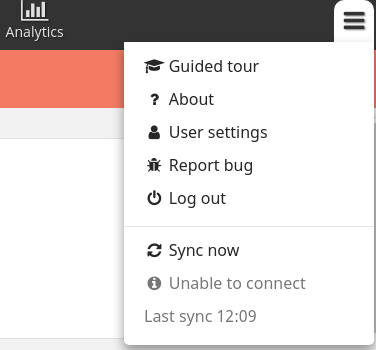

# 3.8.0 Release Notes

- [Known issues](#known-issues)
- [Upgrade notes](#upgrade-notes)
- [Task and target data available for analysis](#task-and-target-data-available-for-analysis)
- [Create Places by SMS](#create-places-by-sms)
- [Replication improvements](#replication-improvements)
- [Performance](#performance)
- [And more...](#and-more)

## Known issues

No known issues.

## Upgrade notes

### Breaking changes

The changes to [tasks and targets](#task-and-target-data-available-for-analysis) require a "3.8 compatible" partner configurations to be deployed for the tasks and target tabs to continue to function. You'll see errors on these tabs and the console error `Rules Engine: Updates to the nools schema are required` if the configuration is not compatible with 3.8. All "3.8 compatible" configurations are backward compatible and can be deployed safely to any Core Framework version. It is therefore recommended to deploy the "3.8 compatible" configuration before upgrading so your application will work seamlessly once the upgrade completes.
  * For partners using declarative configuration, ensure your configuration is deployed using [medic-conf 3.1.0](https://github.com/medic/medic-conf/blob/master/release-notes.md#31) or greater.
  * For partners maintaining their configuration in the legacy `rules.nools.js` file, ensure the latest [schema changes](https://github.com/medic/medic-projects/commit/3bb4cd5ade155cb7eca0e0ea6791cc82796d3949) are deployed.

These changes also result in new constraints for partner application task and target code:

* Tasks with multiple `actions` cannot use different contacts for their `actions[n].content.contact` values. For example, one action cannot open a form for contact `x` and a second action for the same task open a form for contact `y`.
* Reports "with errors" are now available in all task and target calculations (instead of just some calculations) and partner code is responsible for filtering them as necessary.
* For partners maintaining their configuration in a `rules.nools.js` file, multiple contacts emitting tasks with conflicting `id` values is no longer supported. This will result in errant behavior in 3.8.0.
* Target emissions with conflicting `id`s were previously merged based on the order in which the requesting contact was created inside CouchDB. It is now merged based on the order of the requesting contact's `reported_date` attribute.
* The specific meaning of task "resolution" has been augmented to accomodate the additional complexities of reporting a task's "state" in Postgres. Read [the documentation](https://github.com/medic/medic-docs/blob/master/configuration/developing-community-health-applications.md#core-framework-380-and-later) for more information.
* A task's `content` is cached inside the task document. Any timestamps or calculation can be up to seven days old. This is a breaking change for configurations using the current time as part of their calculations.

### High sync times immediately after upgrade

The changes to [tasks and targets](#task-and-target-data-available-for-analysis) may have significant [performance implications](#performance) for some users. Heavy users may see hundreds of new task documents created on their device the first time they load the task or target tabs after upgrading to 3.8.0. Users can expect longer than usual sync times for their first sync after viewing the task or target tab in 3.8.0.

### Supported software

There are no required changes to the [supported software matrix](https://docs.communityhealthtoolkit.org/core/overview/supported-software/) from `3.0.0`.

| Node | CouchDB | Browsers | SMS bridge | Android | medic-android | medic-couch2pg |
|----|----|----|----|----|----|---|
| 8.11+ | 2.1+ | Chrome 53+, Firefox latest | medic-gateway | 4.4+ | 0.4.5+ | 3.0+ |

## Task and target data available for analysis

The task and target system has undergone a significant rework. It is now powered by [task documents](https://docs.communityhealthtoolkit.org/core/overview/db-schema/#tasks) and [target documents](https://docs.communityhealthtoolkit.org/core/overview/db-schema/#targets) which are written to PouchDB and synced to CouchDB/Postgres. This exposes task and target data in CouchDB and Postgres so queries can easily capture how tasks and targets are behaving for users in the field. These changes also set the foundation for powerful collaborative supervisor features to come in the future.

These changes have resulted in important performance changes for the app.

## Create Places by SMS

You are now able to create a place via SMS. This is useful if you wish to create a location before creating a person in that location (e.g. creating a new household before registering a member of that household).

For more information, please read the [configuration information](https://github.com/medic/medic-docs/blob/master/configuration/transitions.md#add_place-as-of-380).

## Replication improvements

Sync status has been reworked to be clearer and more helpful. Specifically, it now specifies whether a lack of syncing is due to a missing internet connection:

See [the github issue](https://github.com/medic/cht-core/issues/3977) for more information.

## Performance

The changes to [Tasks and Targets](#task-and-target-data-available-for-analysis) will have significant performance implications for projects. Many of these changes are hard to succinctly summarize and will vary greatly across project configurations and user types. Here are some performance changes you can expect in 3.8.0:

* *Less Memory Usage* - The retained JS heap size for idle users has been reduced. This reduction is significant for users with many reports or users with large reports. The retained JS heap size for our heaviest known users has been reduced by ~75%!
* *Large First Sync After Upgrade* - Expect longer than normal sync times for the first sync after the upgrade to 3.8.0. Some users may see hundreds of new task documents created on their device when they use the app after upgrading. These new documents need to sync to the server.
* *Increased Disk Usage* - Writing task and target documents into PouchDB means the Core Framework will require more disk usage.
* *Reduced Time to Bootstrap* - The bootstrapping step `Loading rules…` has been removed. This results in drastically reduced bootstrapping times that remain constant regardless of document count. After the user's first replication and load, all users should be able to restart the app and bootstrap within one minute.
* *Long First-Load Time for the Tasks and Targets Tabs* - The loading previously done during the `Loading rules…` bootstrap step now loads the first time a user navigates to the "Tasks" tab or the "Targets" tab. Expect long load times the first time one of these tabs is viewed. But it is only once, even if the user closes the app.
* *Net Performance Gains* - After the first-load of the "Tasks" tab or the "Targets" tab, the tabs will load from a persistent cache. The cache is much faster than the first-load experience, but the tabs will load slower than in previous Core Framework versions. This is a performance trade-off which aims to reduce the _time to complete operations in CHT app_. The net result is a drastically reduced bootstrap time, and a slightly increased load time for specific tabs which provides a net reduction in load times for users to complete tasks.

These trade-offs are complex and we'd love to hear how these changes affect your users and your configuration. Send us your measurements or other feedback on the [CHT Forum](https://forum.communityhealthtoolkit.org/c/support/18).

## And more...

### Features

- [cht-core#5614](https://github.com/medic/cht-core/issues/5614): Add feature to create a place via SMS
- [cht-core#5657](https://github.com/medic/cht-core/issues/5657): Ability to calculate how many tasks are shown and completed by users
- [cht-core#5940](https://github.com/medic/cht-core/issues/5940): Create new API endpoint to replace settings

### Improvements

- [cht-core#3977](https://github.com/medic/cht-core/issues/3977): Improve sync status UI
- [cht-core#5381](https://github.com/medic/cht-core/issues/5381): Add an SMS page to the admin app to group SMS messaging configuration tasks together
- [cht-core#5382](https://github.com/medic/cht-core/issues/5382): Add a Display page to the admin app to group UI configuration tasks together
- [cht-core#5383](https://github.com/medic/cht-core/issues/5383): Move "Settings > Backup & restore" to "Backup app code" in the admin app
- [cht-core#5384](https://github.com/medic/cht-core/issues/5384): Rename and reorder admin app navigation
- [cht-core#5385](https://github.com/medic/cht-core/issues/5385): Update text on admin app Display page
- [cht-core#5386](https://github.com/medic/cht-core/issues/5386): Update text on admin app User page
- [cht-core#5387](https://github.com/medic/cht-core/issues/5387): Update text on admin app SMS page
- [cht-core#5388](https://github.com/medic/cht-core/issues/5388): Update text on admin app App forms page
- [cht-core#5389](https://github.com/medic/cht-core/issues/5389): Update text on admin app Targets page
- [cht-core#5391](https://github.com/medic/cht-core/issues/5391): Update text on admin app Images page
- [cht-core#5392](https://github.com/medic/cht-core/issues/5392): Update text on admin app Upgrades page
- [cht-core#5393](https://github.com/medic/cht-core/issues/5393): Update text on admin app Import & Export page
- [cht-core#5394](https://github.com/medic/cht-core/issues/5394): Update text on admin app Backup page
- [cht-core#5440](https://github.com/medic/cht-core/issues/5440): Add explanatory text about permissions to the admin app
- [cht-core#5493](https://github.com/medic/cht-core/issues/5493): Support a Muso Target - % of families which have received 2 home visits this month
- [cht-core#5608](https://github.com/medic/cht-core/issues/5608): Add python 2.7 to list of required software for developer environment
- [cht-core#5716](https://github.com/medic/cht-core/issues/5716): Update colors in the app and in variables.less file
- [cht-core#6032](https://github.com/medic/cht-core/issues/6032): ADD NO_LABEL TO Contact Objects in the CHT Reference APP
- [cht-core#6103](https://github.com/medic/cht-core/issues/6103): Retry upwards replication
- [cht-core#6104](https://github.com/medic/cht-core/issues/6104): Tab name inconsistencies in Guided Tour vs. Default config
- [cht-core#6166](https://github.com/medic/cht-core/issues/6166): Installation instructions lead to errors
- [medic-android#64](https://github.com/medic/medic-android/issues/64): Expose device information in medic-android so we can store it against monthly telemetry readings
- [medic-conf#113](https://github.com/medic/medic-conf/issues/113): Warn if uploading configuration will overwrite someone elses changes
- [medic-conf#230](https://github.com/medic/medic-conf/issues/230): Allow relative days for date and timestamp columns in csv-to-docs command
- [medic-conf#236](https://github.com/medic/medic-conf/issues/236): Unit tests fail when run locally
- [medic-conf#276](https://github.com/medic/medic-conf/issues/276): Declarative Configuration - Make task/target identification attributes required data integrity of task documents
- [medic-conf#283](https://github.com/medic/medic-conf/issues/283): Declarative Config - Rename passGroupWithCount to passesIfGroupCount
- [medic-docs#142](https://github.com/medic/medic-docs/issues/142): Accessing and interpreting client-side telemetry
- [medic-docs#150](https://github.com/medic/medic-docs/issues/150): Add information about the `known` field in documentation
- [medic-gateway#137](https://github.com/medic/medic-gateway/issues/137): Make sure that Gateway consumes / forwards all SMS before resuming polling
- [medic-nootils#9](https://github.com/medic/medic-nootils/issues/9): Upgrading to medic-nootils@3.x includes test-only dependencies
- [rdt-capture#32](https://github.com/medic/rdt-capture/issues/32): Must target Android 9.0 (API level 28) or above by November 1 2019

### Performance fixes

- [cht-core#5550](https://github.com/medic/cht-core/issues/5550): Measure and if possible improve CouchDB GET performance via API
- [cht-core#6023](https://github.com/medic/cht-core/issues/6023): Timeout option is not set during replication
- [cht-core#6106](https://github.com/medic/cht-core/issues/6106): Call 'db.close' for ephemeral PouchDB objects to avoid memory leaks

### Bug fixes

- [cht-core#2272](https://github.com/medic/cht-core/issues/2272): Make webapp date widget easier to use
- [cht-core#5564](https://github.com/medic/cht-core/issues/5564): Expired tasks don't disappear from the Tasks tab when they expire
- [cht-core#5856](https://github.com/medic/cht-core/issues/5856): appliesToType on the contact summary cards and fields should accept arrays
- [cht-core#5863](https://github.com/medic/cht-core/issues/5863): Translation throwing errors in production
- [cht-core#5864](https://github.com/medic/cht-core/issues/5864): Gateway number validation is too strict
- [cht-core#5866](https://github.com/medic/cht-core/issues/5866): Reports with errors trigger tasks when created/modified but not on reload
- [cht-core#5949](https://github.com/medic/cht-core/issues/5949): Telemetry data are not saved under the right month
- [cht-core#5951](https://github.com/medic/cht-core/issues/5951): Reports page's filter reset button gets cut off on Tecno Y4
- [cht-core#5963](https://github.com/medic/cht-core/issues/5963): The icon in condition cards is displaying too large
- [cht-core#5967](https://github.com/medic/cht-core/issues/5967): Wrap text in contact summary and condition cards
- [cht-core#5982](https://github.com/medic/cht-core/issues/5982): Uploading a custom translation with special characters breaks the admin page.
- [cht-core#6020](https://github.com/medic/cht-core/issues/6020): Current password validation error on Update password form
- [cht-core#6040](https://github.com/medic/cht-core/issues/6040): Age is missing when using unknown for birth date and entering years.
- [cht-core#6053](https://github.com/medic/cht-core/issues/6053): Use relative date of death in list of deceased persons
- [cht-core#6056](https://github.com/medic/cht-core/issues/6056): Death reporting transition requires patient_id
- [cht-core#6062](https://github.com/medic/cht-core/issues/6062): Missing translation warning is displayed in console but doesn't seem to do anything when provided.
- [cht-core#6063](https://github.com/medic/cht-core/issues/6063): Number of days ago does not match date in death report
- [cht-core#6084](https://github.com/medic/cht-core/issues/6084): Timeouts for /api/v1/users leave user at "loading app..." forever
- [cht-core#6087](https://github.com/medic/cht-core/issues/6087): Reduce inbox.js bundle size to meet targets for 3.7 release (800kb)
- [cht-core#6115](https://github.com/medic/cht-core/issues/6115): medic-conf errors when trying to build the default config
- [cht-core#6117](https://github.com/medic/cht-core/issues/6117): Submit not working on Basic Settings tab on  SMS admin page
- [cht-core#6118](https://github.com/medic/cht-core/issues/6118): Deleting a report in mobile view doesn't redirect to list
- [cht-core#6122](https://github.com/medic/cht-core/issues/6122): Lineage hydrateDocs yields inconsistent results and possibly crashes when hydrating the same lineage
- [cht-core#6143](https://github.com/medic/cht-core/issues/6143): Users with a lot of large docs to replicate continuously fail
- [cht-core#6145](https://github.com/medic/cht-core/issues/6145): Image attachments are stored on the report twice
- [cht-core#6163](https://github.com/medic/cht-core/issues/6163): Add implicit configs that were lost when `config.default.json` was removed
- [cht-core#6164](https://github.com/medic/cht-core/issues/6164): Db-doc access fails when accessing a report about a deleted contact
- [cht-core#6169](https://github.com/medic/cht-core/issues/6169): Sentinel doesn't restart its follow feed on error
- [cht-core#6170](https://github.com/medic/cht-core/issues/6170): Having a doc with a non-numeric `reported_date` breaks everything
- [cht-core#6185](https://github.com/medic/cht-core/issues/6185): Unread reports & messages menu bubbles no longer appearing
- [cht-core#6191](https://github.com/medic/cht-core/issues/6191): Supervisors download all task documents from CHWs they supervise
- [cht-core#6205](https://github.com/medic/cht-core/issues/6205): Medic ID never generated if a report is created before sentinel ID is generated
- [cht-core#6208](https://github.com/medic/cht-core/issues/6208): Missing translations
- [horticulturalist#44](https://github.com/medic/horticulturalist/issues/44): The .horticulturalist.lock file prevents horti from restarting when the medic-os docker container restarts
- [medic-conf#168](https://github.com/medic/medic-conf/issues/168): Declarative Config - Document changes which result in appliesTo=false don't cause the task to disappear
- [medic-conf#218](https://github.com/medic/medic-conf/issues/218): Url command-line options are required even for actions which don't use it (regression)
- [medic-conf#240](https://github.com/medic/medic-conf/issues/240): convert-*-forms actions silently convert nothing when extraArgs are provided
- [medic-conf#259](https://github.com/medic/medic-conf/issues/259): Exclamation marks are double escaped in upload-custom-translations
- [medic-conf#278](https://github.com/medic/medic-conf/issues/278): upload-app-forms crashes when deploying projects/muso

### Technical issues

- [cht-core#5129](https://github.com/medic/cht-core/issues/5129): Clean up the horti staging database
- [cht-core#5624](https://github.com/medic/cht-core/issues/5624): Remove use of AngularJS $scope.$broadcast
- [cht-core#5647](https://github.com/medic/cht-core/issues/5647): Update eslint to use ecmaVersion: 2017 to allow async/await pattern
- [cht-core#5791](https://github.com/medic/cht-core/issues/5791): Move scope functions to redux actions
- [cht-core#5890](https://github.com/medic/cht-core/issues/5890): Flakey test: "Navigation tests : should open Report bug"
- [cht-core#5935](https://github.com/medic/cht-core/issues/5935): Provide a UI to perform testing tasks on the phone
- [cht-core#5944](https://github.com/medic/cht-core/issues/5944): Rename `medic` repo to `cht-core`
- [cht-core#5983](https://github.com/medic/cht-core/issues/5983): Bump dependencies for 3.8.0
- [cht-core#6054](https://github.com/medic/cht-core/issues/6054): Make sure app versions are always in sync
- [cht-core#6061](https://github.com/medic/cht-core/issues/6061): Refactor the registration transition
- [cht-core#6134](https://github.com/medic/cht-core/issues/6134): Request persistent storage
