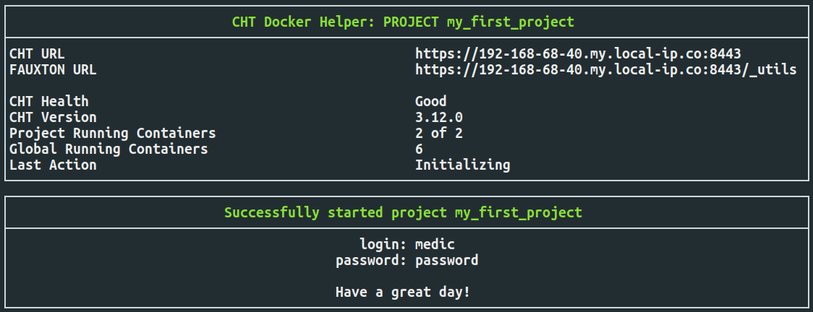
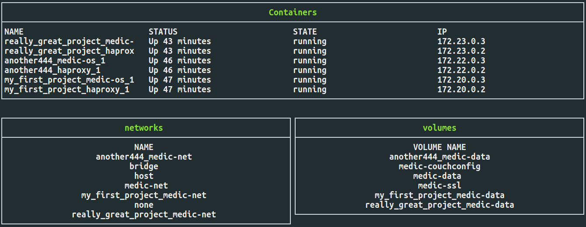

# CHT Docker Compose Helper

## Introduction

These scripts help start CHT instances using `docker-compose` to develop CHT apps on:



This document is a placeholder while this beta version is out for testing.  These documents should and need to be moved to the [docs site](https://docs.communityhealthtoolkit.org/) when this script leaves beta.

Please do not use this script for production hosting. See [Medic's "Hosting" section](https://docs.communityhealthtoolkit.org/apps/guides/hosting/) in our documentation for more information.   

## Prerequisites 

### OS 

The main requirement is Ubuntu OS and this script has only been tested on Ubuntu.  It likely will work on Windows WSL2.  It will not work on MacOS as it's missing the `ip` command.

### Software

The script will check and require these commands. All but the first two should be installed by default on Ubuntu:

* docker
* docker-compose
* ip
* nc
* curl
* tr

### Docker compose file and helper scripts

An up-to-date clone of [cht-core](https://github.com/medic/cht-core/) has everything you need including:

* `docker-compose-developer.yml`
* `cht-docker-compose.sh`
* `docker-status.sh`

## Using

### Syntax

The helper script is run by calling `./cht-docker-compose.sh`.  It accepts one required and one optional arguments:

* `-e | --env-file` - path to the environment file. Required
* `-d | --docker_action` - docker action to run: `up`, `down` or `destory`. Optional, defaults to `up`  

### Nomenclature 

Docker containers, networks and volumes are always named after the project you're using.  So if your project is called `my_first_project`, you will see:
* Two containers: `my_first_project_medic-os_1` and `my_first_project_haproxy_1`
* One storage volume: `my_first_project_medic-data`
* One network: `my_first_project_medic-net`

### First Run

These steps assume:

* the first project is `my_first_project`
* one `.env_docker` environment file per project
* `my_first_project` and `cht-core` directories are next to each other in the same parent directory

Follow these steps to create your first developer instance. You can create as many as you'd like:

1. create `./my_first_project/.env_docker` with the contents:
   ```
   COMPOSE_PROJECT_NAME=my_first_project
   CHT_HTTP=8080
   CHT_HTTPS=8443   
   ```
2. Change into the `docker-help` directory: `cd ./cht-core/scripts/docker-helper/`
3. Run the helper script and specify your `.env_docker` file:
   ```
   ./cht-docker-compose.sh -e ../../../my_first_project/.env_docker
   ```
4. Your CHT instance will be started when you see the text:
   > Successfully started project my_first_project

### Second Run

When you're done with an instance, be sure to shut it down:

```
./cht-docker-compose.sh -e ../../../my_first_project/.env_docker -d down
```

All information will be saved and you can be fully offline when you next start it.  

To start an existing instance again, just run the command from the "First Run" section:

```
./cht-docker-compose.sh -e ../../../my_first_project/.env_docker 
```

This command is safe to run as many times as you'd like if  you forget the state of your project's Docker containers.

### Last Run

When you're done with a project and want to completely destroy it, run `destroy`:

```
./cht-docker-compose.sh -e ../../../my_first_project/.env_docker -d destroy
```

***NOTE*** - Be sure you want to run `destroy`. The script will _not_ prompt "are you sure?" and it will just delete all your project's data.

## Caveats

### Port conflicts

If you have two `.env_docker` files that have the same ports or re-use the same project name, bad things will happen.  Don't do this.

Medic recommends setting up unique project names and unique ports for each project.  Commit these `.env_docker` files to your app config's revision control so all app developers use the same `.env_docker` files.  

### Slow downloads and wait periods

During testing on an Internet connection with high latency (>1000ms) and packet loss, this script had trouble booting the CHT instance because it was taking too long to download the assets from staging.dev.medicmobile.org.  Each version is about 38MB.  

To account for this, the wait time is multiplied times the boot iteration for each time it reboots.  It starts at 100 seconds and then 200, 300, 400 up to the fifth time it will wait 500 seconds. 

## Too many containers

If you're on a resource constrained computer, like a very old or very slow laptop, be sure to watch the total number of containers you're running.  More than one or two projects (2 or 4 containers) and you may notice a slow down. You can use the `./docker-status.sh` script if you forgot which projects you have running:




## Troubleshooting

This script's raison d'être is to avoid troubleshooting!  Hopefully you don't have any problems, but please report them if you do. As well, see "Caveats" above.

If any scripts fail to exit, you can hit hold down the control key and press "c" (`ctrl + c`) to quit out of the script.

If you REALLY get stuck and want to destroy _**ALL**_ docker containers/volumes/networks, even those not started by this script, run this (but be  _**extra**_ sure that's what you want to do):

```
docker stop $(docker ps -q)&&docker system prune&&docker volume prune
```
