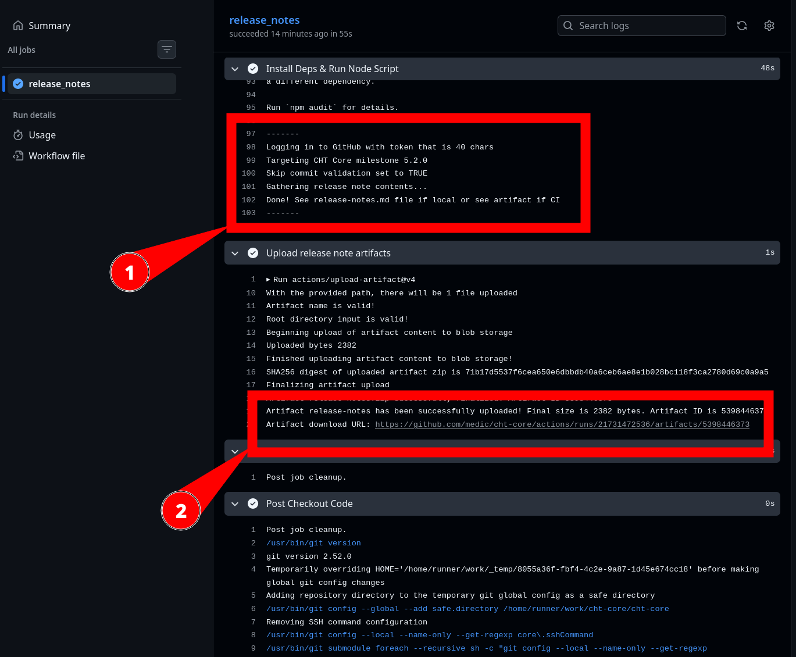
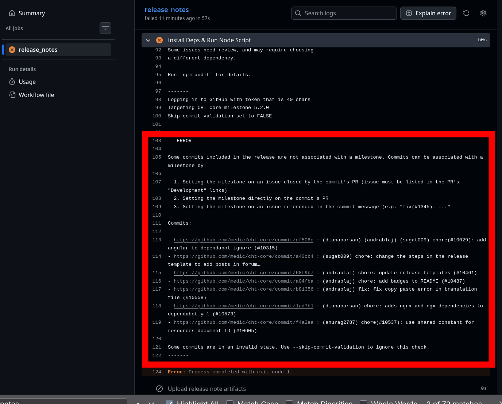

# Release notes generator script

**Caution** - Avoid storing your [GitHub token](https://docs.github.com/en/authentication/keeping-your-account-and-data-secure/managing-your-personal-access-tokens?creating-a-token=#keeping-your-personal-access-tokens-secure) in clear text.  Ideally release notes are only securely created in GitHub Actions as it avoids local tokens use.  Token are [dangerous](https://github.blog/security/hardening-repositories-against-credential-theft/) in the wrong hands.

## Install & Setup

Make sure you have the utils installed:

* `git` [installed](https://git-scm.com/install/)
* `gh` [installed](https://cli.github.com/)

After that, make sure you have:

* Logged in to `gh` by running `gh auth login`
* A GitHub account with read access to CHT Core Repo

## Usage

Start by manually running the CI job, specifying the milestone (`5.2.0` in this case), but using the `gh` command locally on your workstation:

```shell
gh workflow run release-notes.yml -f version=5.2.0
```

If the job is successful, this text will show in the CI output in the "Install Deps & Run Node Script" section (we'll cover if it failed below):

```
-------
Logging in to GitHub with token that is 40 chars
Targeting CHT Core milestone 5.2.0
Skip commit validation set to TRUE
Gathering release note contents...
Done! See release-notes.md file if local or see artifact if CI
-------
```

Below that in the "Upload release note artifacts", you can see the URL to download the release notes markdown file:

```
Artifact release-notes.zip successfully finalized. Artifact ID 5398446373
Artifact release-notes has been successfully uploaded! Final size is 2382 bytes. Artifact ID is 5398446373
Artifact download URL: https://github.com/medic/cht-core/actions/runs/21731472536/artifacts/5398446373
```

Here's a screenshot with `#1` showing the "Install Deps & Run Node Script" section `#2` showing the  "Upload release note artifacts" section.



Alternately, at the more high level view for the job, there's a nice GUI linked to the same artifact.


When you have a finalized output of the `release-notes`, you can create a new document in the [releases section of the docs](https://docs.communityhealthtoolkit.org/releases/). Be sure to update the `_index.md` in that same `releases` directory to include the new release.

### Fixing commits

Very likely the CI will failed with an error in the the "Install Deps & Run Node Script" section and no artifact will be saved. The error will start with `---ERROR--- Some commits included...` as shown below. For each of the commits, follow the steps listed to correctly associate the commit with the milestone.

If all commits have been fixed, run the above `gh` command locally to re-run the action run on GitHub. Check the output of the CI, repeating the fix and re-run cycle as needed.

### Sample error output

Here's the ASCII output:

```
-------
Logging in to GitHub with token that is 40 chars
Targeting CHT Core milestone 5.2.0
Skip commit validation set to FALSE

---ERROR----

Some commits included in the release are not associated with a milestone. Commits can be associated with a milestone by:

Setting the milestone on an issue closed by the commit's PR (issue must be listed in the PR's "Development" links)
2. Setting the milestone directly on the commit's PR
3. Setting the milestone on an issue referenced in the commit message (e.g. "fix(#1345): ..."

Commits:

- https://github.com/medic/cht-core/commit/d57ab5 : chore: bump deep-equal-in-any-order from 2.0.6 to 2.1.0 (#10424)
- https://github.com/medic/cht-core/commit/f797be : chore: bump globals from 16.3.0 to 16.5.0 (#10431)
```

And a screenshot of the same:



### Skipping commit checks in CI

To force CI to generate the release notes markdown and skip any commit checks, pass in an extra `skip` argument:

```shell
gh workflow run release-notes.yml -f version=5.2.0 -f skip_commit_checks='--skip-commit-validation'
```

## Development

First, get all setup making sure each item is done in order:

1. Have `node` and `npm` [installed](https://nodejs.org/en/download)
2. Have a local and up to date clone of [CHT Core](https://github.com/medic/cht-core)
3. Run `npm ci` in the `scripts` directory of CHT Core
4. Ensure you're logged in to `gh` via  `gh auth login`

Then you can call the script locally when you're in the `scripts/release-notes` directory which takes the name of the milestone (e.g. `5.2.0`) as it's argument:

```shell
GITHUB_TOKEN=$(gh auth token) node index.js 5.2.0
```

If there were no commit check errors, a file will be created in the `scripts/release-notes` directory called `release-notes.md` with the markdown.

### Skipping commit checks in dev

To force node to generate the release notes markdown and skip any commit checks, pass in an extra `skip` argument:

```shell
GITHUB_TOKEN=$(gh auth token) node index.js 5.2.0 --skip-commit-validation
```
