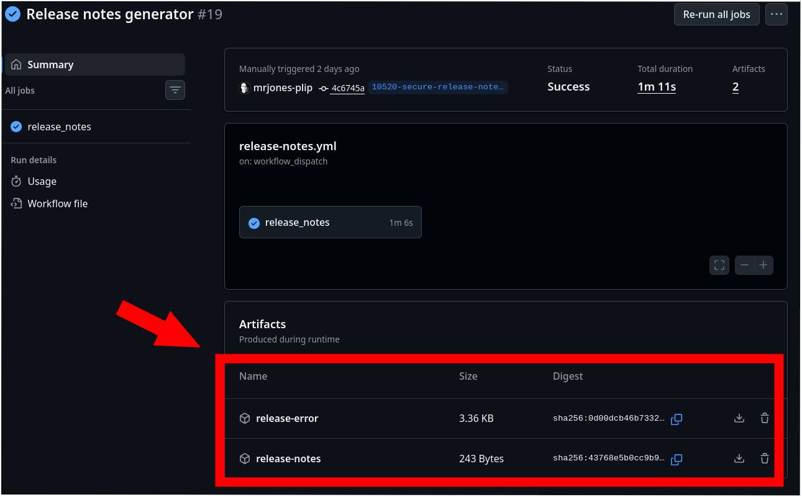

# Release notes generator script

**Caution** - Avoid storing your [GitHub token](https://docs.github.com/en/authentication/keeping-your-account-and-data-secure/managing-your-personal-access-tokens?creating-a-token=#keeping-your-personal-access-tokens-secure) in clear text.  Ideally release notes are only securely created in GitHub Actions as it avoids local tokens use.  Token are [dangerous](https://github.blog/security/hardening-repositories-against-credential-theft/) in the wrong hands.

## Install & Setup

Make sure you have the utils installed:

* `git` [installed](https://git-scm.com/install/)
* `gh` [installed](https://cli.github.com/)

After that, make sure you have:

* Logged in to `gh` by running `gh auth login`
* A GitHub account with read access to CHT Core Repo

## Usage



Every time a beta branch is cut, CI automatically runs and saves the output of the [release note job](https://github.com/medic/cht-core/actions/workflows/release-notes.yml). Each run will have `release-error` and `release-notes` artifacts. You'll need to fix all the commit errors found in `release-error` (see below for a how-to) and then manually re-run the CI. Use the `gh` command locally to re-run the action run on GitHub:

```shell
gh workflow run release-notes.yml
```

The re-run will show up in the [release note job](https://github.com/medic/cht-core/actions/workflows/release-notes.yml) list and clicking into each run, you can again check `release-error` for any errors.  When you've resolved all the errors, the release notes markdown will be in `release-notes`. You can re-run as many times as needed.

### Fixing commits

Very likely the CI will have saved a bunch of output in `release-error` as shown below. For each of the commits, follow the steps listed to correctly associate the commit with the milestone. Re-run the CI to test if all commits have been fixed

### Sample error output

>Some commits included in the release are not associated with a milestone. Commits can be associated with a milestone by:
>
> 1. Setting the milestone on an issue closed by the commit's PR (issue must be listed in the PR's "Development" links)
> 2. Setting the milestone directly on the commit's PR
> 3. Setting the milestone on an issue referenced in the commit message (e.g. "fix(#1345): ..."
>
> Commits:
>
> - https://github.com/medic/cht-core/commit/d57ab5 : chore: bump deep-equal-in-any-order from 2.0.6 to 2.1.0 (#10424)
> - https://github.com/medic/cht-core/commit/f797be : chore: bump globals from 16.3.0 to 16.5.0 (#10431)

## Development

First, get all setup making sure each item is done in order:

1. Have `node` and `npm` [installed](https://nodejs.org/en/download)
2. Have a local and up to date clone of [CHT Core](https://github.com/medic/cht-core)
3. Run `npm ci` in the `scripts` directory of CHT Core
4. Ensure you're logged in to `gh` via  `gh auth login`

Then you can call the script locally when you're in the `scripts/release-notes` directory:

```shell
GITHUB_TOKEN=$(gh auth token) node index.js
```

Options:
- `--help` - Show the help message
- `--skip-commit-validation` - Skip validation of commits

