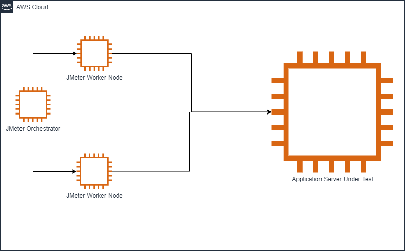

# Scalability testing suite

## Introduction

This suite is to test the scalability of CouchDB so we can check what our limits are and ensure we don't regress on performance.

Initially it only tests replication but should be extended to test other APIs.

## Requirements

- jMeter
- NodeJS
- a target medic instance
- multiple test users
- realistic data (reports, contacts, etc) 

## Setup

### GUI
1. Go to `/tests/scalability` and run `npm install`.
2. Edit the `config.json` doc with the server url and an array of users to test.
3. Load jMeter and open the `sync.jmx` file.
4. In the Test Plan configure the `working_dir` and `node_binary` variables.
5. In the Test Plan > Thread Group configure the number of threads you want to execute. The users configured in step 2 will be used in round robin so you can have more or fewer threads than users.
6. Run it!

### CLI

1. Go to `/tests/scalability` and run `npm install`.
2. Edit the `config.json` doc with the server url and an array of users to test.
3. Run CLI command to execute tests.
4. Index.html report is generated in the report directory specified by the -o param. 

Required Parameters:  
`Jworking_dir` 
`Jnode_binary`

Optional Parameters:

`loop_count` Default: 1  
`number_of_threads` Default: 10  
`ramp_up_period` Default: 1

Example Command:  
`jmeter -n  -t sync.jmx -Jworking_dir=./ -Jnode_binary=node/v8.12.0/bin/node -l ./previous_results/3.3.0.jtl -e -o ./report`

## Reviewing Previous Runs

### Requirements

Install the plugins manager

https://jmeter-plugins.org/wiki/PluginsManager/

Install Merge Results Plugin

https://jmeter-plugins.org/wiki/MergeResults/

### Merging Results
The data used to run this and environment should hopefully be the same each run. Use CSV to docs to generate data on empty database. Create users with medic-conf in the appropriate place. 

1. Using the jmeter [merge results plug-in](https://jmeter-plugins.org/wiki/MergeResults/). 
2. Open the jmeter 
3. Click jp@gc - Merge Results Element
4. Add a row to the Merge Options for the new test run. Add a prefix label of the version running against.
5. Click Merge
6. Generate the report using command `jmeter -g ./combined/3.3.0-combined -o ./combined-dash`
7. Navigate to combined-dash folder and open index.html to see merged results. 

# Running tests on AWS

Github actions monitors the cht-core repo for a new beta tag. This triggers the execution of our scalability suite on ec2 instances.  The configuration for github is located in `cht-core/.github/workflows/scalability.yml`.

### Github Action Workflow

The action checks out cht-core and then execute two scripts. One start medic-os related tasks and another to execute jmeter.

### Start Medic Script

The script `start_ec2_medic.sh` begins by requesting an ec2 instance in the ca-central-1 region. While it is starting it gets the public DNS name of that instace. The instance is started with `user-data` script located at `cht-core/tests/scalability/medic-os.sh`. AWS cli requires the script be encoded in base64. That step is handled in the start scripts.  This brings up medic-os in docker on that machine using the `prepare.sh` script in the `cht-infrastructure` repo. 

While docker compose is bringing up medic-os. `start_ec2_medic.sh` starts to check for API to be up by curling  `https://$PublicDnsName/api/info` until a version number is returned. 

Medic-conf and it's dependencies are now installed. Medic-conf then uploads standard config and the seed data which are located in `cht-core/config/standard` and `cht-core/tests/scalability/csv`. Then we wait for sentinel to process all these changes by checking the sentinel-meta-data processed sequence against the `_changes`  feed with the since request param. 

From here we get the ddocs update sequences. Stage the branch which is associated to the tag that triggered this whole flow. Then check that the sequence numbers have increased. This is a simple sanity check that the views should have warmed. Then complete the upgrade. 

### Start Jmeter Script

Once the medic script completes we begin setting up for jmeter. The `start_jmeter_ec2.sh` script launches a new ec2 instance with the `user-data` script at `cht-core/tests/scalability/run_suite.sh`. 

The script clones cht-core and navigates to the scalability dir. Then installs java, nodejs, jmeter, and its plugins. Executes the scalability suite which is defined in the `cht-core/tests/scalability/sync.jmx`, and finally it uploads the results to an s3 bucket. 

## Distributed Workflow

Our current setup has 1 ec2 instance acting as the JMeter Orchestrator with 2 worker nodes. This can generate 1400 virtual users. Against our Application environment under test. 

### Setup

1. Launch an ec2 instance c5.2xlarge(Orchestrator)
1. Launch 2 ec2 instances of c5.4xlarge(Worker)
1. SSH into each of these machines. Using the ubuntu user and ensure it has sudo permissions.
1. Copy `tests/scalability/jmeter_setup.sh` to the user directory(`/home/ubuntu`).
1. On each of the three VMs, call  `chmod +x jmeter_setup.sh && ./jmeter_setup.sh` . This clones cht-core, installs JAVA, installs Node 14, runs npm install, installs JMeter, and its plugins. The resulting directory will be `/home/ubuntu/cht-core/tests/scalability`.
1. On the orchestrator node, update the `cht-core/tests/scalability/config.json` and ensure the users are valid(can login as offline user), and the URL points to your instance under test. 
1. Split the `config.json` on the orchestrator
    1. `cd cht-core/tests/scalability`
    1. `npm install` 
    1. Using `node split_config.js --workerCount 2 --filePath './config.json'`
    NOTE: This will split the file into `conf-N.json`. Where N is the based on the worker count. The file needs to be copied and named `config.json` on the worker node.
    JMeter does not send any data to the workers. All it does is trigger the action to run as if you were doing it manually on that machine. You will need to split the `config.json` to have users for each worker node. 
1. On the orchestrator node, create a [RMI key](https://jmeter.apache.org/usermanual/remote-test.html#setup_ssl)
    1. cd jmeter/bin
    1. ./create-rmi-keystore.sh
    1. hit return for all answers to accept the default. On the the last one type, type yes
1. Copy `rmi_keystore.jks` (RMI Key) and `conf-0.json`(rename once copied to `config.json`) split to the two worker nodes into `cht-core/tests/scalability/.`. Each worker node should get a different config file.
1. Start jmeter server on the worker nodes. 
    1. `cd cht-core/tests/scalability`
    1. `./jmeter/bin/jmeter-server`
1. Execute the distributed run from the orchestrator:
    1. `cd cht-core/tests/scalability`
    1. `rm -rf report/ report_remote/`
    1. `./jmeter/bin/jmeter -n  -t sync.jmx -Gnumber_of_threads=700 -Gramp_up_period=5 -Gworking_dir=/home/ubuntu/cht-core/tests/scalability/ -Gnode_binary=/usr/bin/node -l ./report_remote/cli_run.jtl -e -o ./report_remote -R 3.8.93.43,3.11.81.213`

    NOTE: The params as listed. 
    * `-Gnumber_of_threads` number of virtual users. If you have a `config.json` with the number of users matching number of threads. You will have 1 unique user per thread. If your config is less it will reuse users. 
    * `-Gramp_up_period` number of seconds before the next thread starts. 
    * `-Gworking_dir` working directory on the worker node. This is the same since we are using the `run_suite.sh` to setup everything. 
    * `-Gnode_binary` path to node on the worker node.
    * `-l ./report_remote/cli_run.jtl` output file on the orchestrator
    * `-R 3.8.93.43,3.11.81.213` comma separated list of the worker nodes ip addresses. 
  1. Review the results in `cht-core/tests/scalability/report_remote`. The cli_run.jtl is the raw results. There should be a generated report with an `index.html` to view as well. 
  NOTE: Review the `jmeter-server.log` or `jmeter.log` files in the `cht-core/tests/scalability` dir for real time details. 
